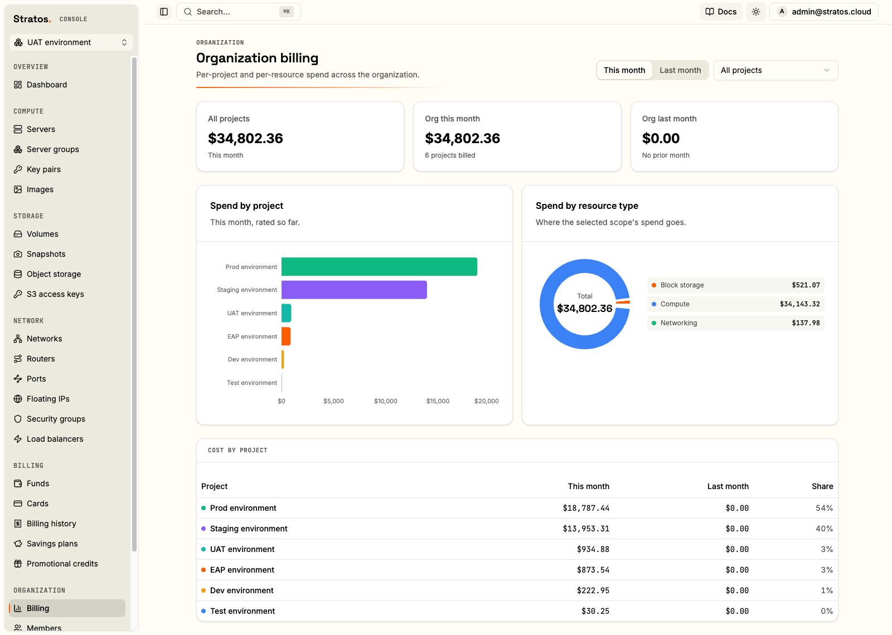
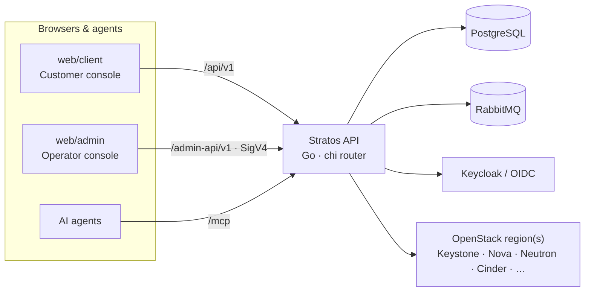

<div align="center">

# Stratos

**Multi-tenant cloud billing & self-service portal for OpenStack**

<p>
  
  
  
  
  
</p>

<p>
  <a href="https://github.com/menlocloud/stratos/actions/workflows/test.yml"></a>
  <a href="https://github.com/menlocloud/stratos/actions/workflows/docker.yml"></a>
  <a href="https://github.com/menlocloud/stratos/actions/workflows/helm.yml"></a>
</p>

<p>
  <a href="#-quickstart"><b>Getting Started</b></a>
  · <a href="https://github.com/menlocloud/stratos/discussions">Community</a>
  · <a href="CHANGELOG.md">Changelog</a>
  · <a href="https://github.com/menlocloud/stratos/issues">Bug reports</a>
</p>

</div>

<p align="center">
  
</p>

<p align="center"><sub><i>The operator console — per-project and per-resource spend across the organization.</i></sub></p>

Stratos turns an OpenStack cloud into a product: customers sign up, launch and
manage compute / storage / network resources from a web console, and are billed
for what they use. Operators configure regions, pricing, invoicing, and
promotions from a separate admin console. A built-in MCP server exposes the same
capabilities to AI agents.

- **Customer console** (`web/client`) — self-service cloud + billing for end users.
- **Operator console** (`web/admin`) — pricing, regions, invoicing, and account administration.
- **API** (Go) — one backend serving three surfaces: the customer API, the SigV4-signed operator API, and an MCP endpoint.

> [!WARNING]
> **Tested against OpenStack 2026.1.** The reference target is OpenStack 2026.1
> deployed with kolla-ansible. Any Keystone v3 cloud should work, but other
> releases are unverified.

## Contents

- [Features](#-features)
- [Architecture at a glance](#-architecture-at-a-glance)
- [Quickstart](#-quickstart)
- [Repository layout](#-repository-layout)
- [Tech stack](#-tech-stack)
- [Documentation](#-documentation)
- [Build & test](#-build--test)
- [Contributing](#-contributing)
- [License](#-license)

## ✨ Features

- **Self-service cloud** — provision and manage instances, volumes, networks, floating IPs, load balancers, object storage and shares against one or more OpenStack regions, plus S3 object storage on Ceph RGW (buckets, per-key access, static websites).
- **Usage-based billing** — metered consumption rated against configurable price plans, resource types, currencies and tax rules.
- **Invoicing & payments** — automated invoices, account credits, card and bank-transfer payments (Stripe), and automated suspension for overdue accounts.
- **Savings plans & promotions** — commitment discounts, promotional credits, and sign-up bonuses.
- **Multi-org / multi-project RBAC** — organizations, projects, per-project roles, and user invitations.
- **OpenStack integration** — resource sync, usage metrics collection, and event notifications, with per-service enable/disable.
- **MCP server** — a Model Context Protocol endpoint so AI agents can drive the platform with the same auth and permissions as a user or operator.
- **Identity via OIDC** — Keycloak or any OpenID Connect provider, browser sign-in over authorization-code + PKCE.

## 🧭 Architecture at a glance



One Go process serves all three HTTP surfaces on port `8080` and runs scheduled
jobs (billing, sync, metrics) internally; a separate management port (`8081`)
exposes health and operational triggers.

## 🚀 Quickstart

### Local (Docker Compose)

Brings up the API + both SPAs + PostgreSQL + RabbitMQ:

```sh
docker compose up --build
```

| Service | URL |
|---------|-----|
| API | `http://localhost:8080` (management `http://localhost:8081`) |
| Customer console | `http://localhost:8082` |
| Operator console | `http://localhost:8083` |

Auth-gated and cloud routes need an external OIDC issuer and an OpenStack region.
Put `STRATOS_OAUTH2_*` and `OS_*` values in a `.env` file (see
`docker-compose.yml` for the keys) — without them the app runs but those routes
stay dark.

### Kubernetes (Helm)

The chart bundles PostgreSQL, RabbitMQ, and Keycloak by default (each toggle-able):

```sh
helm install stratos oci://ghcr.io/menlocloud/charts/stratos \
  -n stratos --create-namespace
```

See [`deploy/chart/README.md`](deploy/chart/README.md) for values,
external PostgreSQL/OIDC wiring, and ingress / Gateway API exposure.

## 📂 Repository layout

<details>
<summary>Expand the full path-by-path map</summary>

| Path | Contents |
|------|----------|
| `cmd/api` | Service entrypoint — HTTP servers + background jobs |
| `internal/platform` | Business domains: `account`, `org`, `project`, `billing`, `payment`, `pricing`, `catalog`, `order`, `promotion`, `rbac`, `admin`, `adminapi`, `mcp`, `scheduler`, … |
| `internal/cloud` | OpenStack providers, resource sync, usage metrics, notifications |
| `internal/{config,server,amqp,oidc,pgdoc,health}` | Wiring: config, HTTP server, messaging, auth, Postgres store, health |
| `pkg` | Reusable libraries: `auth`, `httpx`, `money`, `textcrypt`, `audit` |
| `deploy` | `Dockerfile`, Helm chart (`chart`), seed data |
| `web/client` | Customer console (React SPA) |
| `web/admin` | Operator console (React SPA) |
| `test/integration` | Integration tests (build tag `integration`) |

</details>

## 🧰 Tech stack

- **Backend** — Go 1.25, [chi](https://github.com/go-chi/chi) router, PostgreSQL (jsonb document store via [pgx](https://github.com/jackc/pgx)), RabbitMQ, [gophercloud](https://github.com/gophercloud/gophercloud) for OpenStack, Stripe, the [MCP Go SDK](https://github.com/modelcontextprotocol/go-sdk), and [koanf](https://github.com/knadh/koanf) config (env + `application.yml`).
- **Frontends** — React 19 + Vite + TypeScript, Tailwind CSS v4, shadcn/ui + Radix, TanStack Query, and `react-oidc-context` (authorization-code + PKCE).
- **Identity** — Keycloak or any OIDC provider.

## 📚 Documentation

**Engineering docs** (this repo, under [`docs/`](docs/) — start at the [docs index](docs/README.md)):

- [Architecture](docs/architecture.md) — system overview, boot sequence, module map, request flow.
- [Data model](docs/data-model.md) — PostgreSQL/JSONB document tables + entity-relationship diagram.
- [Authentication](docs/auth.md) — OIDC resource server, realms, SigV4 admin keys, MCP auth.
- [API overview](docs/api.md) — the `/api/v1`, `/admin-api/v1`, and `/mcp` surfaces + conventions.
- [Billing](docs/billing.md) — pricing, accrual, bills, transactions, savings, suspension.
- [Cloud integration](docs/cloud-integration.md) — OpenStack providers, resource sync, metrics.
- [Jobs & scheduling](docs/jobs-scheduling.md) — the scheduler, distributed locking, charge fan-out.
- [Configuration](docs/configuration.md) — env / `application.yml` / Helm values reference.
- [Development](docs/development.md) · [Testing](docs/testing.md) · [Glossary](docs/glossary.md) · [Decision records](docs/adr/).

**Product / user documentation** ships inside the apps, served at `/docs` in each
console (source under `web/client/src/docs/content` and `web/admin/src/docs/content`):
the customer manual, operator manual, administrator manual, and the interactive
Admin API + MCP reference.

For operations and deployment, see the [Helm chart README](deploy/chart/README.md).
For contributing and local development, see [`CONTRIBUTING.md`](CONTRIBUTING.md).

## 🧪 Build & test

<details>
<summary>Backend, frontend, and image build commands</summary>

```sh
make build             # go build ./...
make vet               # go vet ./...
make test              # go test ./...
make test-integration  # integration tests (needs Docker — throwaway Postgres via testcontainers)
make binary            # static api binary -> bin/stratos-api
make image             # build the api container image
```

Frontends:

```sh
cd web/client   # or web/admin
npm install
npm run dev     # Vite dev server
npm run build   # type-check + production build
npm run lint    # oxlint
```

Container images (`stratos`, `stratos-web`, `stratos-admin`) and the Helm chart
are published to `ghcr.io/menlocloud` by CI on pushes to `main` and tagged
releases.

</details>

## 🤝 Contributing

Issues and pull requests are welcome — please read [`CONTRIBUTING.md`](CONTRIBUTING.md)
and our [Code of Conduct](CODE_OF_CONDUCT.md). To report a security issue, see
[`SECURITY.md`](SECURITY.md).

## 📄 License

Stratos is licensed under the **GNU Affero General Public License v3.0**
(AGPL-3.0-only). See [`LICENSE`](LICENSE).
