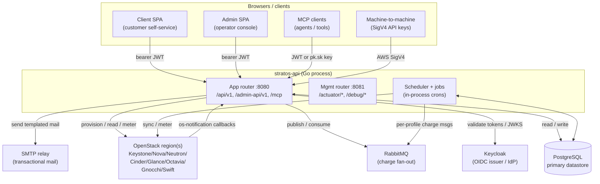
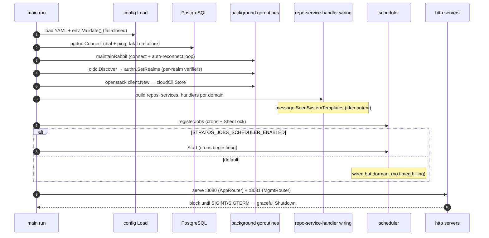
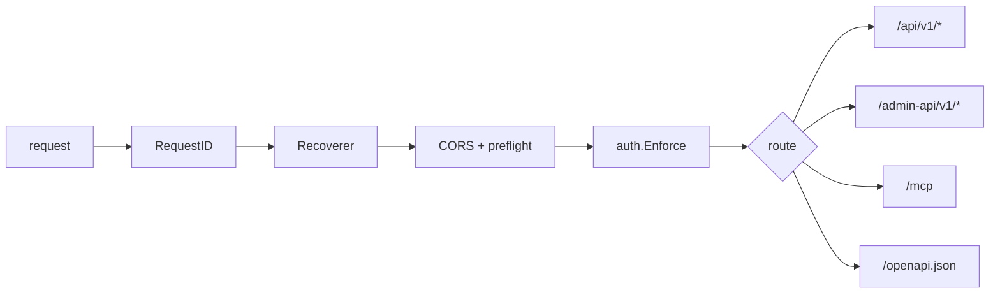
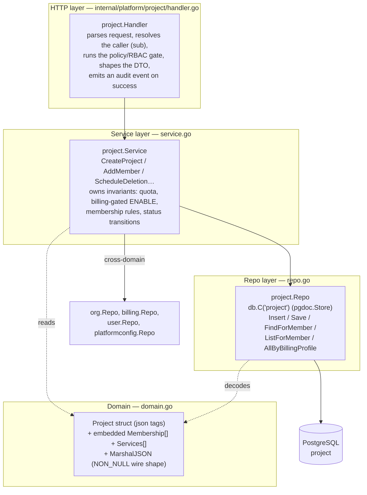
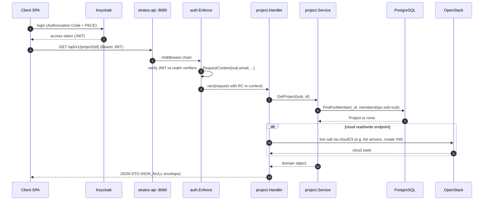
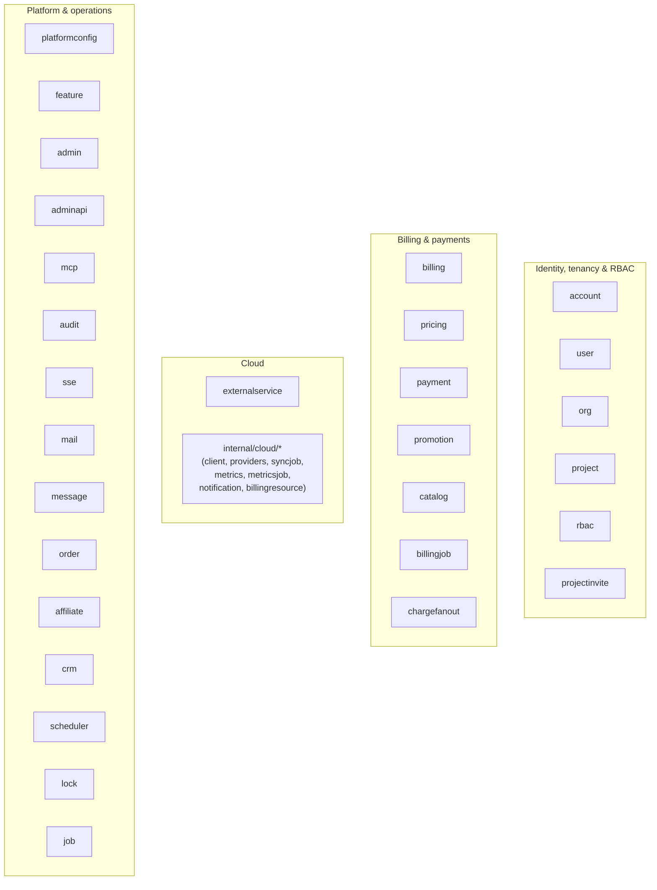
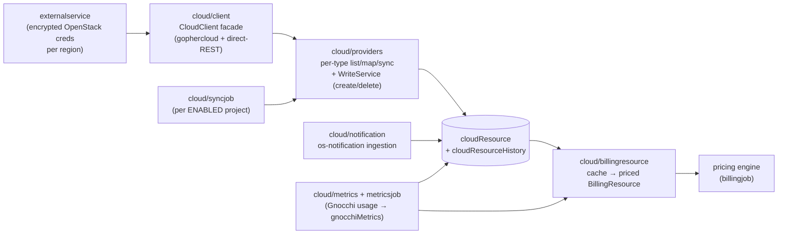

# Stratos — Architecture

Stratos is a self-service cloud platform for an OpenStack-backed public/private
cloud: it lets customers organize into organizations and projects, provision and
manage cloud resources (servers, volumes, networks, floating IPs, load
balancers, object storage, …), and it meters that usage, prices it, bills it,
and collects payment. It is a single Go service (`stratos-api`) fronting a
PostgreSQL primary datastore, a RabbitMQ broker, an OIDC identity provider
(Keycloak), and one or more OpenStack regions.

This document is the system-level map: how the process boots, how requests are
routed and authenticated, how the code is layered, and what the modules are. The
deep dives live in sibling docs:

- **[data-model.md](data-model.md)** — the PostgreSQL document tables and their relationships (ERD).
- **[auth.md](auth.md)** — token validation, the RBAC permission kernel, the SigV4 admin-API scheme.
- **[billing.md](billing.md)** — billing profiles, rating/pricing, bills, payments, suspension.
- **[cloud-integration.md](cloud-integration.md)** — OpenStack clients, the resource cache, sync, metrics, notifications.
- **[jobs-scheduling.md](jobs-scheduling.md)** — the cron catalog, cross-fleet locking, and the RabbitMQ charge fan-out.

---

## 1. System context (containers)

The process listens on **two ports**. `:8080` is the public API surface behind
the ingress; `:8081` is the management/operations port (health probes, on-demand
job triggers, a cloud connectivity probe) and is never exposed to the internet.

PostgreSQL is connected **eagerly at startup** — dialed and pinged before the
service listens, so a failed connection aborts the boot — while RabbitMQ, OIDC
discovery, and OpenStack authentication happen on background goroutines, so those
unreachable dependencies degrade a capability rather than blocking the boot.

---

## 2. Boot sequence

`cmd/api/main.go` is the single entrypoint. `run()` performs a deterministic
wiring pass — construct repos, then services, then handlers, then the router and
jobs — and hands off to two HTTP servers.

Key properties of the boot, all visible in `run()`:

- **Config is fail-closed.** `config.Load()` reads a mounted YAML file overlaid
  by environment variables (env wins), and `cfg.Validate()` refuses to start a
  half-configured process.
- **Indexes are ensured in the background.** User/org/project/invite repos kick
  off `EnsureIndexes` on goroutines so a slow index build never blocks listen.
- **The authenticator starts empty and fills in.** `auth.New` is wired into the
  router immediately; realms arrive later from `oidc.Discover`. Until then,
  bearer tokens fail closed (401) — the service is always safe, never open.
- **The cloud client is a lazily-populated pointer.** `cloudCli
  atomic.Pointer[client.Client]` is declared before the project handler and
  resolved by a background goroutine once OpenStack auth succeeds; handlers read
  it through a `func() *client.Client` accessor, so cloud-write endpoints simply
  return "not ready" until the cloud is reachable.
- **Jobs are wired but gated.** Every cron is registered, but the scheduler only
  `Start()`s when `STRATOS_JOBS_SCHEDULER_ENABLED=true`. A plain deploy therefore
  never charges a bill on a timer; operators drive the flow deterministically via
  the `:8081` `/debug/run-*` triggers when those are enabled.
- **Cross-service wiring uses setters to break import cycles.** For example the
  org handler can't import project, so `orgH.SetProjectMemberAdder(projectSvc)`
  injects the project service after both exist. The same pattern wires the
  activation service, cloud suspend/resume, and admin cloud operations.

---

## 3. Request routing & middleware

`internal/server/server.go` builds two routers with **chi**.

### App router (`:8080`)

A single middleware chain wraps every request, in order:

- **RequestID / Recoverer** — chi built-ins: correlation id + panic-to-500.
- **CORS** — echoes the specific allowed Origin (never `*`, because requests are
  credentialed with a bearer token) and answers `OPTIONS` preflight with `204`
  **before** auth runs, so preflight never 401s. Allowed origins are derived from
  the configured UI/admin base URLs plus an optional `STRATOS_CORS_ALLOWED_ORIGINS`
  list.
- **auth.Enforce** — the gate. Public paths pass through (a valid token is still
  parsed if present, since some public DTOs vary by auth); every other request
  needs a valid credential or gets a `401` with an empty body and
  `WWW-Authenticate: Bearer`. See [auth.md](auth.md).

**Three route surfaces** share the port:

| Surface | Prefix | Auth scheme | Purpose |
|---|---|---|---|
| Client + operator API | `/api/v1/*` | OIDC bearer (client & admin realms) | The whole product: account, org, project, billing, cloud, admin. Admin endpoints live under `/api/v1/admin/**` and are gated by an `adminPermission` record, not a separate realm. |
| Public Admin API | `/admin-api/v1/*` | AWS SigV4 (hmac keys) **or** dedicated admin-api OIDC realm | Machine-to-machine integration surface with snake_case envelopes and keyset pagination. |
| MCP | `/mcp` | Dual scheme: realm JWT **or** `Bearer pk.sk` key | Model Context Protocol endpoint; tool calls dispatch back through the app router in-process. |

**Public-path whitelist** (`pkg/auth`, `IsPublic`): exact paths (`/error`,
`/api/v1/platform-configuration/default`, the billing config country/currency
lists, the RFC 9728 resource-metadata doc) and prefixes (`/openapi.json`, `/mcp`,
`/api/v1/auth/`, `/api/v1/download/`, `/api/v1/notifications/`,
`/api/v1/callbacks/`, `/api/v1/payments/`, `/api/v1/admin/job/`,
`/api/v1/admin/onboarding/`, `/api/v1/webhooks/`,
`/api/v1/events/`). These are the webhook, download-token, SSE, and operator
callback paths that authenticate by their own scheme (token in the URL, SigV4,
signed webhook) rather than a bearer header.

### Management router (`:8081`)

A plain `net/http.ServeMux`: `GET /actuator/health` (liveness),
`GET /actuator/health/readiness` (PostgreSQL ping + RabbitMQ health),
`GET /actuator/info`, a build probe, an optional `GET /debug/cloud` connectivity
probe, and — when jobs are enabled or debug-triggers are on — a family of
`POST /debug/run-*` triggers to drive crons on demand (sync, metrics, charge,
collect, dunning, savings expiry, project deletion, HMAC key minting, mail send,
RabbitMQ self-test).

---

## 4. Layering: handler → service → repo

Each domain follows the same three-layer shape. Handlers speak HTTP and identity,
services hold business rules, repos own one PostgreSQL table. Using the
**project** domain as the worked example:

Concretely, `POST /api/v1/project` flows: the handler resolves the caller's `sub`
and target org, then `Service.CreateProject` builds memberships from the org's
members, defaults the project to `DISABLED`, and flips it to `ENABLED` only when
billing is unconfigured **or** the org's billing profile is `ACTIVE` (enforcing
the per-profile/platform project quota along the way). Persistence is
`Repo.Insert`, which stamps `createdAt`/`updatedAt` and reads back the generated
24-char hex id as the string `_id`.

Notable conventions this example shows:

- **Services depend on other domains' repos, never their handlers.** The project
  service holds `org.Repo`, `billing.Repo`, `user.Repo`, `platformconfig.Repo`.
  This keeps the dependency graph a DAG; the few genuine cycles are broken with
  setters wired in `main` (§2).
- **The wire shape is explicit.** Domain structs that serialize directly (like
  `Project`) carry a hand-written `MarshalJSON` implementing NON_NULL semantics:
  null fields are omitted, but non-null empty collections (`memberships:[]`,
  `services:[]`, `customInfo:{}`) are always present.
- **Embedded vs. referenced.** Memberships and attached services live **inside**
  the project document (queried via the `memberships.sub` and
  `services.externalProjectId` paths), whereas organization and billing profile
  are referenced by id. See [data-model.md](data-model.md) for the full picture.

### A full authenticated request

Token **validation** is the only thing the API does with Keycloak on the hot
path — Stratos is a resource server, not the IdP. The authenticated `sub` becomes
the tenant principal; a domain `User` row is created only on the explicit user
init endpoint, so handlers that need a `User` look it up and return "User is not
initialized" if absent.

---

## 5. Module map

The code is organized as one Go module (`github.com/menlocloud/stratos`) with
`internal/platform/*` domain packages, an `internal/cloud/*` OpenStack subsystem,
and a handful of infrastructure packages (`internal/{config,server,oidc,pgdoc,
amqp,health}`, `pkg/{auth,httpx,textcrypt,money,audit}`).

### Identity, tenancy & RBAC

| Module | Responsibility |
|---|---|
| `account` | Customer User/Account own-record endpoints; the principal is resolved (get-or-create by `sub`) before these run. |
| `user` | The domain `User` — the tenant principal keyed by `sub`; get-or-create semantics, `users` table. |
| `org` | Organization slice: org CRUD, members, org-level RBAC, custom role definitions, and the org audit-log read. |
| `project` | Project slice: project CRUD, embedded memberships, project-level RBAC, and the client cloud read/write endpoints. |
| `rbac` | Pure authorization kernel: permission keys, the wildcard permission matcher, and the built-in role→permission tables (no DB). |
| `projectinvite` | Create/lookup/accept/decline project invitations (TTL-indexed), with the invite email and audit trail. |

### Billing & payments

| Module | Responsibility |
|---|---|
| `billing` | Billing-profile domain + reads (billing summary), bills, account credit, savings plans/contracts, suspension/activation services, and the bill-finalization job. |
| `pricing` | The rating core: price plans, price-plan rules, tax rates, price-adjustment rules, and the engine that turns usage values into net amounts. |
| `payment` | Payment gateway operations (Stripe card charges/setup, add-funds, register-card, collect, bank transfer) plus the stuck-transaction scanner. |
| `promotion` | Promotion/deposit config reads and promo-code redemption into promotional credit. |
| `catalog` | Cloud-catalog config reads: flavor categories, image groups/categories, instance-metadata options (admin-configured document tables). |
| `billingjob` | The charge-cron driver: load active profiles + services, and rate each billable cloud resource per time unit. |
| `chargefanout` | The multi-pod alternative to the in-process charge loop: publish one RabbitMQ message per active profile; any pod's consumer drains the queue. |

### Cloud

| Module | Responsibility |
|---|---|
| `externalservice` | The `externalService` table backing each region's cloud connection, with its encrypted-at-rest `secret` decrypted on read — the pod's source of OpenStack credentials. |
| `internal/cloud/*` | The OpenStack subsystem (see §6): the client facade, resource providers, the resource cache + history, sync/metrics jobs, os-notification ingestion, and the cloud→billing bridge. |

### Platform & operations

| Module | Responsibility |
|---|---|
| `platformconfig` | The single per-deployment platform config doc (branding, date format, regions, project quota, login config) the UI bootstraps from. |
| `feature` | Feature-flag reads: the available feature set and per-feature enabled checks. |
| `admin` | The `/api/v1/admin/**` surface + admin authorization kernel: a caller is admin iff their `sub` has an `adminPermission` record whose role resolves to a permission set. |
| `adminapi` | The public `/admin-api/v1` machine-to-machine API (SigV4 or admin-api realm), snake_case envelopes, keyset pagination. |
| `mcp` | The Model Context Protocol endpoint with a client toolset and an admin toolset; tools dispatch in-process through the app router. |
| `audit` | The audit pipeline: the `auditEvent` domain, an async writer, and cursor-paginated queries; events are emitted by handlers after a successful mutation. |
| `sse` | The real-time event stream: an in-memory subscriber pool + per-connection heartbeat; pushes cloud-resource events to a project's open connections. |
| `mail` | The mail-send foundation: a mailer interface + SMTP gateway (no-op when unconfigured). |
| `message` | Named, admin-editable email templates rendered with `{{var}}` placeholders; system templates seeded if-absent at startup. |
| `order` | Provisioning-order reads (order-by-id). |
| `affiliate` | Affiliate endpoints: referral check + per-project affiliate config/log. |
| `crm` | CRM-sync integration point (contacts/segments/user sync) with a stub provider until a CRM is connected. |
| `scheduler` | The cron engine (seconds-enabled cron) wrapping each job in a cross-fleet lock. |
| `lock` | The `shedLock`-backed distributed lock so a scheduled job runs once across the pod fleet. |
| `job` | The operator job-trigger endpoints under `/api/v1/admin/job/*` (whitelisted; runs the in-process job, else returns 202). |

---

## 6. The cloud subsystem (`internal/cloud/*`)

The cloud layer is what makes Stratos a *cloud* platform: it turns OpenStack
state into a queryable cache, meters it, and prices it. It is summarized here;
the full treatment is in **[cloud-integration.md](cloud-integration.md)**.

- **`client`** — the `CloudClient` facade hiding whether a call goes through
  gophercloud (compute/network/volume/image/load-balancer) or a direct-REST
  transport (Gnocchi metrics, object storage). Built per external service, and
  for suspend/sync it is scoped to a specific tenant/region.
- **`providers`** — one provider per cloud resource type; each lists its objects,
  maps them to a `CloudResource`, and upserts into the cache with an optimistic
  two-op write plus a `cloudResourceHistory` soft-delete + recreation guard. A
  `WriteService` performs live create/delete. The resource-type taxonomy is broad
  (`SERVER`, `VOLUME`, `NETWORK`, `PORT`, `FLOATING_IP`, `LOAD_BALANCER`,
  `IMAGE`, `KEYPAIR`, `BUCKET`, `SHARE*`, `ROUTER`, `SUBNET`, `SECURITY_GROUP`,
  DNS/VPN/Trilio/Barbican types, …).
- **`syncjob`** — walks every `ENABLED` project and, per attached CLOUD service,
  lists and upserts resources into the cache (with tenant-scoping so no
  cross-tenant leak).
- **`notification`** — the OpenStack "Notifier URI": Ceilometer HTTP-POSTs oslo
  lifecycle events to `/api/v1/notifications/{externalServiceId}/{region}`,
  which are routed by `event_type`, re-read live, and applied to the cache
  (keeping it fresh between syncs), then pushed to SSE subscribers.
- **`metrics` / `metricsjob`** — the scheduled Gnocchi usage ingestion: per
  `SERVER`/`PORT`, fetch the month's billable traffic and persist `gnocchiMetrics`.
- **`billingresource`** — the cloud→billing bridge: turn cached resources (plus
  Gnocchi usage for traffic-billed types) into the priced `BillingResource`s the
  rating loop consumes.

---

## 7. Cross-cutting concerns

### Authentication & authorization (`pkg/auth`, `internal/oidc`)

Three OIDC realms are configured (`Auth.Main`, `Auth.Admin`, `Auth.AdminAPI`);
`oidc.Discover` builds a verifier per realm in the background. `auth.Enforce`
validates the bearer JWT against each realm's verifier and populates a
`RequestContext{sub, email, givenName, familyName, issuer, azp}`. The public
`/admin-api/v1` surface additionally accepts **AWS SigV4** signatures verified
against `hmac_keys` (`pkg/auth/sigv4.go`). Authorization is layered on top: the
`rbac` kernel resolves role→permission sets for org/project actions, and admin
access hinges on an `adminPermission` record for the caller's `sub`. Full detail
in **[auth.md](auth.md)**.

### Configuration (`internal/config`)

`config.Load()` reads a mounted YAML file overlaid by environment variables (env
always wins), and `Validate()` fails closed. Config groups: server/management
ports, the PostgreSQL DSN (`STRATOS_DB_URL`), RabbitMQ, the data-at-rest `Encryption.DefaultKey` (used by
`pkg/textcrypt` to decrypt external-service secrets), self URLs (API/UI/admin base
URLs, which also seed CORS), the three auth realms, the OpenStack dev-bootstrap
connection, and the `Jobs` gates (`SchedulerEnabled`, `DebugTriggers`,
`RabbitFanout`).

### Async & scheduling (`internal/amqp`, `scheduler`, `lock`)

Scheduled work is driven by a seconds-enabled cron; every job is wrapped in a
`shedLock`-backed distributed lock (`atMostFor` / `atLeastFor`) so it runs **once
across the fleet**, not once per pod. The catalog is registered in
`main.registerJobs` — the minutely/hourly/monthly charge crons, Gnocchi metrics,
services sync, savings expiry + reminders, transaction scan, auto-suspension
(dunning), monthly bill finalization, monthly collect, and project deletion.

The charge cron has two execution modes: an **in-process loop** by default, or a
**RabbitMQ fan-out** (`STRATOS_JOBS_RABBIT_FANOUT=true`) that publishes one
message per active billing profile so any pod's consumer can charge one profile —
isolating per-profile failures across the fleet. RabbitMQ itself is maintained by
a background reconnect loop so readiness self-heals after a dropped connection.
Full catalog + cron expressions in **[jobs-scheduling.md](jobs-scheduling.md)**.

### Audit (`internal/platform/audit`)

Handlers emit audit events **after** a successful mutation through an async writer
(`LogAsync`), so auditing never blocks or fails the request. The `auditEvent`
table is queried by the client org/account audit-log endpoints with cursor
pagination.

### Money & serialization (`pkg/money`, `pkg/httpx`)

Monetary values are handled as `decimal.Decimal` (stored as a JSONB decimal
string, `"12.34"`) via `pkg/money` (no float
drift). `pkg/httpx` owns the response envelope, the `RequestContext` carried in
`context.Context`, and the shared 401/404/405 handlers — giving every surface a
consistent NON_NULL JSON shape.

---

## 8. Where to go next

- The document tables and their relationships → **[data-model.md](data-model.md)**
- How a token becomes a permission decision → **[auth.md](auth.md)**
- How usage becomes a bill and a payment → **[billing.md](billing.md)**
- How OpenStack state becomes a cached, metered resource → **[cloud-integration.md](cloud-integration.md)**
- The full cron catalog and locking model → **[jobs-scheduling.md](jobs-scheduling.md)**
