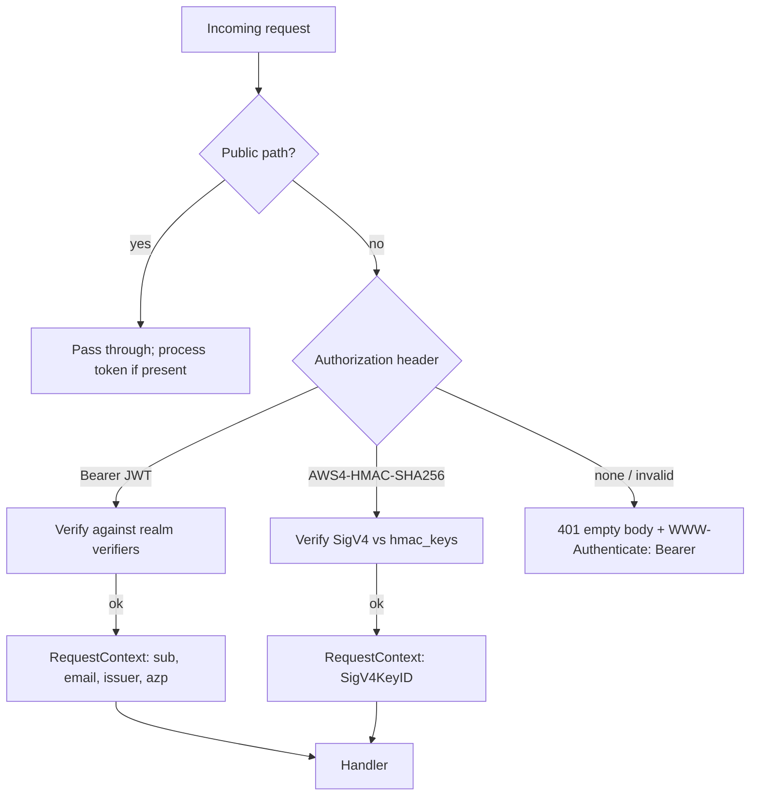
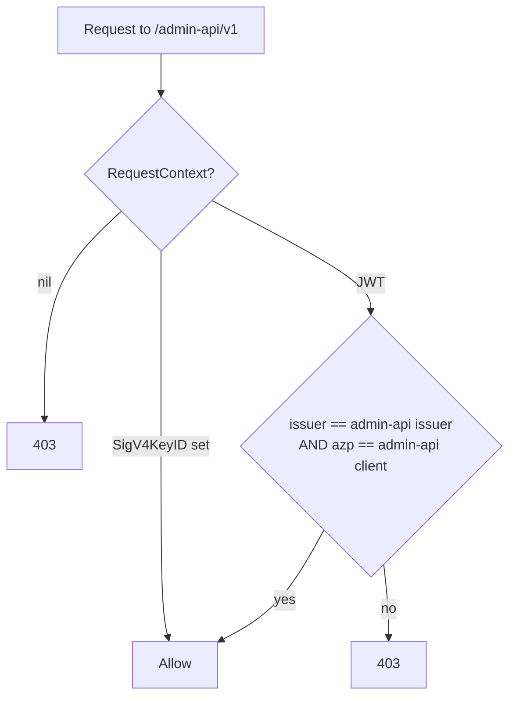
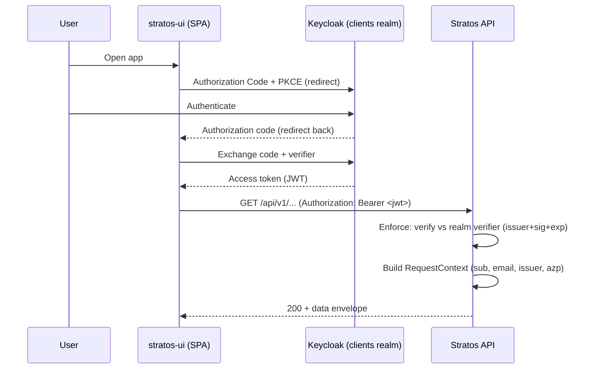

# Authentication & Authorization

This document describes how Stratos authenticates and authorizes requests. It is
aimed at contributors working on the API, the admin surface, or the MCP endpoint.

## Model: Stratos is an OAuth2 Resource Server

Stratos **validates** access tokens; it does not **issue** them. Identity lives in
an external OpenID Connect (OIDC) provider. The Helm chart bundles Keycloak by
default (`keycloakx.enabled: true`), but any standards-compliant OIDC provider can
be pointed at instead (`keycloakx.enabled: false`, then point `auth.*.issuer` at
that provider).

At startup the API discovers each configured realm's OIDC metadata in the
background, so the service never blocks on an unreachable issuer. Until discovery
succeeds a realm's verifier is `nil` and tokens for that realm are rejected `401`.
See `internal/oidc/oidc.go` (`Discover`) and `pkg/auth/auth.go` (`SetRealms`).

Token validation enforces **issuer + signature + expiry**. The client-ID check is
intentionally relaxed (`SkipClientIDCheck`) because public-client tokens carry
`aud=account` rather than the app's client id; the authorized-party (`azp`) claim
is what gates the admin surfaces (see the Admin API gate below).

Validating a token **authenticates** the caller (populating a per-request
`RequestContext`) but does **not** create a platform `User` record. Handlers that
need the domain user look it up and fail if it has not been initialized.

### Realms and clients

Two Keycloak realms back the platform, with three public PKCE clients:

| Realm | Who | Public client(s) | Toolset / surface |
|-------|-----|------------------|-------------------|
| `clients` (display "Cloud console") | Customers | `stratos-ui` | Customer API `/api/v1`, MCP client tools |
| `master` (display "Cloud Admin") | Operators / machines | `stratos-admin`, `stratos-admin-api` | Admin console, Admin API `/admin-api/v1`, MCP admin tools |

The service maps these to three realm configs — `auth.main` (customer), `auth.admin`
(operator console), `auth.admin-api` (machine Admin API) — each an issuer URI + client
id (`internal/config/config.go`, `OAuth2Realm`). `auth.admin` and `auth.admin-api`
both point at the `master` realm issuer, distinguished by their client id.

## The three credential schemes



### 1. OIDC JWT Bearer — `/api/v1` and `/admin-api/v1`

`Authorization: Bearer <jwt>`. The `Enforce` middleware
(`pkg/auth/auth.go`) tries each discovered realm verifier in turn; the first that
validates wins. Claims `sub`, `email`, `given_name`, `family_name`, `azp`, plus the
issuer, are copied into the `RequestContext` (`pkg/httpx/context.go`). A missing or
invalid token on a protected path returns `401` with an **empty body** and headers
`WWW-Authenticate: Bearer` and `X-Content-Type-Options: nosniff`.

### 2. AWS SigV4 — `/admin-api/v1` (machine-to-machine)

`Authorization: AWS4-HMAC-SHA256 Credential=<keyId>/<date>/<region>/<service>/aws4_request, SignedHeaders=..., Signature=...`

The verifier (`pkg/auth/sigv4.go`) parses the `Credential`, resolves `<keyId>`
against the `hmac_keys` table to its secret, checks `X-Amz-Date` is within a
5-minute skew, rebuilds the canonical request, recomputes the signature through the
standard SigV4 HMAC key-derivation chain, and compares it constant-time. Region and
service are **not** pinned — they are read from the credential scope. On success the
`RequestContext` carries `SigV4KeyID`.

### 3. MCP dual auth — `/mcp`

The MCP endpoint (`internal/platform/mcp/mcp.go`) accepts either scheme:

- **OIDC JWT** — already validated by `Enforce` (the path is on the public
  whitelist, but a valid bearer is still processed into the `RequestContext`). The
  MCP gate maps the token issuer to a toolset: `master` realm → admin tools,
  `clients` realm → client tools, anything else → `403`. MCP clients obtain the
  token through the standard MCP OAuth flow (see RFC 9728 discovery below).
- **API key** — `Authorization: Bearer <pk>.<sk>`, an `hmac_keys` pair joined by a
  dot, matching `^(pk[0-9a-f]{32})\.(sk[0-9a-f]{40})$`. The `sk` is compared
  constant-time against the stored secret; a match grants the **admin** toolset.

Unauthenticated requests get an RFC 9728 challenge (below), which drives compliant
MCP clients into the OAuth flow.

## The Admin API gate

`/admin-api/v1` sits behind an extra authorization gate on top of `Enforce`
(`internal/platform/adminapi/adminapi.go`, `gate`). A request passes when **either**:

- it authenticated via **SigV4** (`RequestContext.SigV4KeyID` is set), **or**
- it carries a **JWT from the admin-api realm** — `Issuer` equals the configured
  `auth.admin-api` issuer **and** `azp` equals the `auth.admin-api` client id
  (`stratos-admin-api`).

Everything else returns `403`. So a valid customer (`clients` realm) token
authenticates at the platform level but is still refused at the Admin API gate.



## Public-path whitelist (`permitAll`)

`IsPublic` (`pkg/auth/auth.go`) lets a fixed set of paths bypass bearer
enforcement. On these paths a valid token is still processed if present (some DTOs
vary by auth), but no credential is required.

**Exact paths:**

| Path | Why |
|------|-----|
| `/error` | Error rendering |
| `/api/v1/platform-configuration/default` | Bootstrap config for the login page |
| `/.well-known/oauth-protected-resource` | RFC 9728 resource metadata for MCP |
| `/api/v1/admin/billing/configuration/countries` | Public reference data |
| `/api/v1/admin/billing/configuration/currencies` | Public reference data |

**Prefixes:**

| Prefix | Why |
|--------|-----|
| `/openapi.json` | OpenAPI document |
| `/mcp` | MCP endpoint (the MCP handler runs its own dual-scheme gate) |
| `/api/v1/auth/` | Login / auth callbacks (owned by the IdP flow, not bearer-protected) |
| `/api/v1/download/` | Signed download links |
| `/api/v1/notifications/` | Cloud notification webhook ingestion |
| `/api/v1/callbacks/` | Third-party callbacks |
| `/api/v1/payments/` | Payment gateway callbacks |
| `/api/v1/admin/job/` | Operator job triggers |
| `/api/v1/admin/onboarding/` | Onboarding **status** read (the setup mutations are not exposed) |
| `/api/v1/webhooks/` | Generic inbound webhooks |
| `/api/v1/events/` | SSE real-time streams |

CORS preflight (`OPTIONS`) is answered `204` **before** enforcement, so it never
`401`s (`internal/server/server.go`, `corsMiddleware`).

## HMAC keys

HMAC key pairs authenticate the Admin API (SigV4) and the MCP admin toolset
(`pk.sk`). Shape:

- **id / access key:** `pk` + 32 hex chars (an MD5 digest) — e.g. `pk3f2a…`
- **secret key:** `sk` + 40 hex chars (a SHA-1 digest) — e.g. `sk9c81…`

Stored in the `hmac_keys` table as `{ _id: <pk>, secretKey: <sk>, description,
createdAt }`. The secret is returned **once at creation** and never re-served in
full by the read endpoints.

Create a key two ways:

- **Admin console** → System → HMAC Keys, which calls `POST /api/v1/admin/hmac-keys`
  (permission `admin:hmac_key:manage`). See `internal/platform/admin/hmackey.go`.
- **Operator management port** → `POST :8081/debug/gen-hmac-key?description=...`
  (only registered when job debug triggers / scheduler are enabled). See
  `cmd/api/main.go`.

Resolution at request time is a single `hmac_keys` lookup by `_id`
(`cmd/api/main.go`, `hmacLookup`), wired into both the SigV4 verifier
(`SetHmacLookup`) and the MCP gate.

## RFC 9728 discovery (MCP OAuth)

An unauthenticated `/mcp` request returns:

```
401 Unauthorized
WWW-Authenticate: Bearer resource_metadata="<api-base-url>/.well-known/oauth-protected-resource"
```

That metadata document (served publicly) advertises the authorization servers a
client should use:

```json
{
  "resource": "<api-base-url>/mcp",
  "authorization_servers": ["<clients-realm-issuer>", "<master-realm-issuer>"],
  "bearer_methods_supported": ["header"]
}
```

Compliant MCP clients then run discovery + dynamic client registration + a PKCE
localhost-redirect flow against the advertised Keycloak realm and return with a
Bearer JWT.

### In-process tool dispatch

MCP tools are declarative rows (`tools_client.go`, `tools_admin.go`) that map to
existing REST endpoints. Each call is dispatched **through the full router
in-process**, so org/project policy, DTO shapes, and audit behave exactly like the
public API. JWT principals dispatch with their own bearer; API-key principals
dispatch with a SigV4 signature minted on the fly from the validated pair
(`pkg/auth/sigv4sign.go`, `SignSigV4`, using the conventional `us-east-1` /
`execute-api` scope).

## Customer SPA login (PKCE) sequence



## Configuring the external IdP

Each realm is a pair of issuer URI + client id. They can be set via config file
(`auth.main.oauth2.*`, `auth.admin.oauth2.*`, `auth.admin-api.oauth2.*`) or env
(`AUTH_MAIN_OAUTH2_ISSUER_URI` / `_CLIENT_ID`, and the `AUTH_ADMIN_*` /
`AUTH_ADMIN_API_*` equivalents). See `docs/configuration.md`.

In Helm, when bringing your own OIDC provider (`keycloakx.enabled: false`), set:

- `auth.main.issuer` → the **customer** (`clients`) realm issuer
- `auth.admin.issuer` → the **operator** (`master`) realm issuer
- `auth.adminApi.issuer` → the machine **Admin API** realm issuer
- client ids stay on `auth.main.clientId` / `auth.admin.clientId` /
  `auth.adminApi.clientId` (defaults `stratos-ui` / `stratos-admin` /
  `stratos-admin-api`)

The auth domain and admin domain are independent and may differ. On the external
IdP you must create, per realm, a public OIDC client (standard flow + PKCE) with
the matching client id, redirect URIs, and web origins; the chart provisions
nothing on an external provider. See `deploy/chart/values.yaml` and the
chart README for the full checklist.
