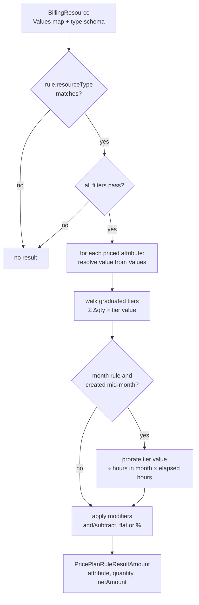
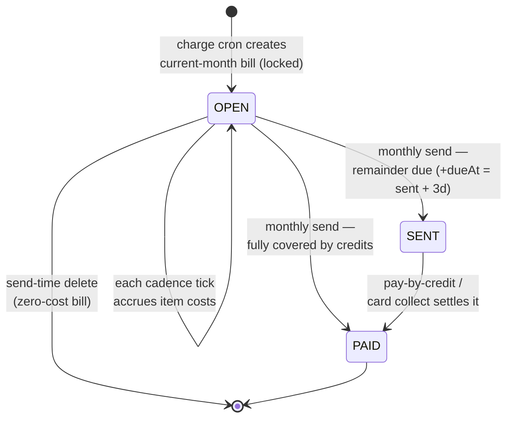
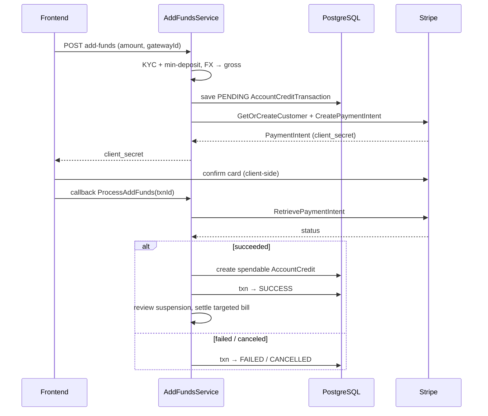
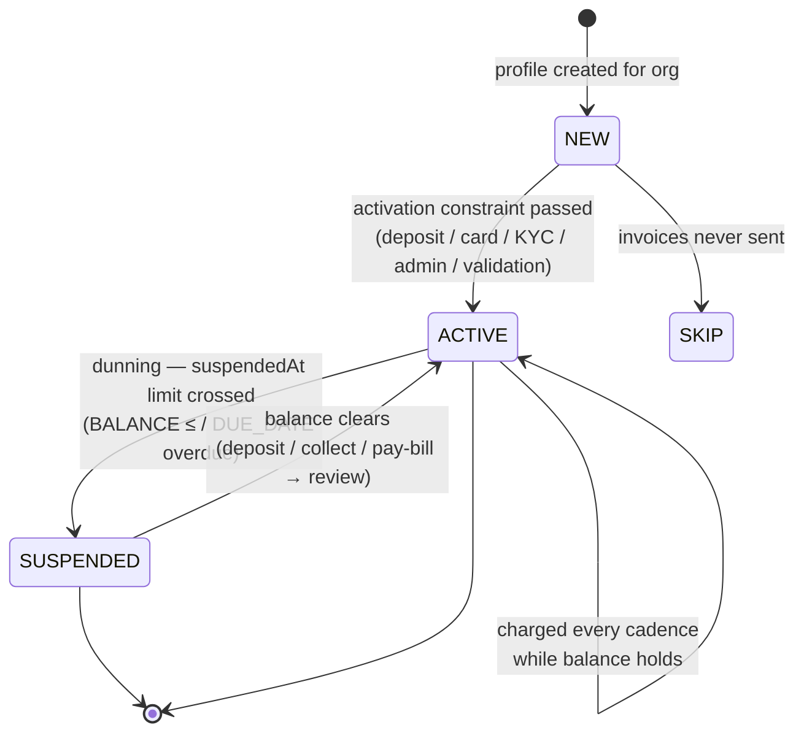
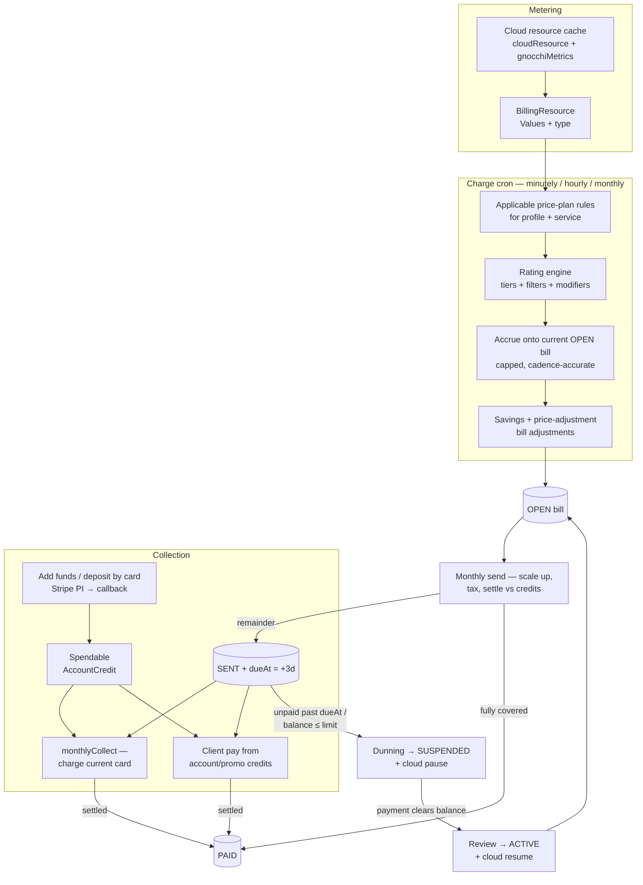

# Billing subsystem

A deep guide to Stratos billing — the metering, rating, invoicing, payment, and
dunning engine that turns OpenStack cloud usage into money owed and money
collected. Audience: contributors working anywhere in the billing code.

Everything here is grounded in the Go source. Money is **never** a float; all
arithmetic is exact decimal.

---

## 1. Package map

| Package | Path | Responsibility |
|---|---|---|
| `pricing` | `internal/platform/pricing` | The rating core: price-plan/rule domain + the pure rating math, bill assembly, tax, FX, credits, settlement, and the suspension **decision** predicates. Golden-tested, mostly pure. |
| `billing` | `internal/platform/billing` | The billing-profile aggregate, the PostgreSQL repos, and the stateful services: balance/due, bill send, pay-by-credit, savings contracts + reminders, suspension **orchestration**, gateways, cards, activation. |
| `billingjob` | `internal/platform/billingjob` | The charge cron driver — loads active profiles + resources and drives `pricing` to accrue costs onto the current bill. |
| `chargefanout` | `internal/platform/chargefanout` | Optional RabbitMQ fan-out of the charge job (one message per profile) as a multi-pod alternative to the in-process loop. |
| `payment` | `internal/platform/payment` | Money-in flows: add funds, deposit/collect by card, register card, the Stripe gateway, and the stuck-transaction scanner. |
| `promotion` | `internal/platform/promotion` | Client promo-code redemption → promotional credit. |
| `catalog` | `internal/platform/catalog` | Cloud-catalog config reads (flavor categories / image groups). |
| `billingresource` | `internal/cloud/billingresource` | The cloud → billing bridge: turns a cloud resource (server, volume, floating IP, …) into the priced `BillingResource`(s) the rating loop consumes. |
| `admin/*` | `internal/platform/admin` | Admin CRUD for pricing config, savings, tax, and manual transactions/credits. |
| `pkg/money` | `pkg/money` | The `Money` decimal type (JSON string ↔ shopspring/decimal). |

---

## 2. Concepts & entities

### Billing profile — the billed entity

`billing.BillingProfile` (table **`billingProfile`**) is the account that
gets charged. It is attached to an **organization** (`organizationId`) and owns
the projects whose usage it pays for. Key fields:

- **`status`** — `NEW` → `ACTIVE` → `SUSPENDED` → back to `ACTIVE`, plus `SKIP`
  (a profile whose invoices are never sent). Only `ACTIVE` profiles are charged.
- **`currency`** — the profile's invoice currency (defaults to the platform base
  currency at create time).
- **`company` / `taxPayer` / `country` / `vatCode`** — drive tax-rate selection.
- **`pricePlanConfig`** (`PricePlanConfiguration`: `pricePlanIds` + `includePublicPricePlans`)
  — which price plans apply to this profile.
- **`overwriteSuspension` / `suspensionConfiguration`** — per-profile dunning
  override of the global policy.
- **`defaultCardId`**, **`reseller`** (resellers are never auto-suspended),
  **`activationConstraints`**, **`activatedAt`**.

A profile is created for an org with `Repo.CreateForOrganization` — status `NEW`,
base currency, a default `pricePlanConfig` (`includePublicPricePlans: true`), and a
single contact.

### Price plans and price-plan rules

A **price plan** (`pricing.PricePlan`, table **`pricePlan`**) is a named,
enabled bundle of pricing. Its `accessMode` is one of:

- **`PUBLIC`** — applies to every profile that opts into public plans.
- **`SCOPED`** — applies only to profiles that reference it by id in
  `pricePlanConfig.pricePlanIds`.

A plan may be narrowed to specific external services via `serviceProviders`
(match by `serviceId`); an empty list means "all services"
(`PricePlan.IsServiceProviderScoped`).

A **price-plan rule** (`pricing.PricePlanRule`, table **`pricePlanRule`**,
FK `pricePlanId`) is where the money lives. Each rule targets a **resource type**
and a **time unit**, and carries:

- **`prices[]`** — a priced **attribute** (`attributeName`) with graduated
  **tiers** (`from` / `to` / `value`). Tiers are additive and graduated: the
  charge for a value walks every tier and sums each tier's `Δquantity × value`
  (`Engine.applyTier`). `from == nil` is a flat per-unit tier; an open-ended top
  tier has `to == nil`; a non-zero `from` is treated inclusively (`from-1`).
- **`filters[]`** — match gates on resource attributes (`eq`/`neq`/`gt`/`gte`/
  `lt`/`lte`/`contains`/`startsWith`/`in`). ALL filters must pass for the rule to
  apply. Number comparisons are resource-vs-rule.
- **`modifiers[]`** — conditional post-adjustments to a rated amount (`add`/
  `subtract`, flat or `asPercentage`). Chained; each modifier's output feeds the
  next.
- **`applyMethod`** — `ADD_TO_TOTAL` (default) or `OVERWRITE_TOTAL`. Effect is
  applied during the monthly bill rollup, not inside the per-rule engine.

**Time units and their divisors.** Rules are cadenced. The cadence controls both
how often a rule is charged and the per-cycle **cap** (`BillingContext.timeUnitLimit`,
from `billingConfiguration.settings.timeUnitLimits`, else defaults):

| Time unit | Default limit (per month) | Meaning |
|---|---|---|
| `minute` | 43200 | 30 days × 24 × 60 |
| `hour` | 720 | 30 days × 24 |
| `month` | 1 | one charge per cycle |

A `month`-cadenced rule on a non-display resource created mid-month is **prorated
by the hour**: `pricePerHour = tier.value ÷ (daysInMonth × 24)` (a DECIMAL128
division), then `× hoursElapsedSinceCreation` (`Engine.getTierValue`).

### Price adjustment rules

`pricing.PriceAdjustmentRule` (table **`priceAdjustmentRule`**, FK
`pricePlanId`) is a bill-level, enabled, tiered add/subtract applied **after**
rating. Its `targets[]` (resourceType + filters) select which bill items feed the
"usage" amount; tiers are sorted **descending** by `startAmount`, and the first
tier whose `startAmount ≤ usage` supplies a modifier (flat or `asPercentage`,
`add`/`subtract`). No targets → the rule applies to the whole bill's item sum.

### Resource types & billable attributes

`internal/cloud/billingresource` declares what is metered. `Catalog()` returns the
billable resource types; each provider maps a cloud resource into a
`pricing.BillingResource` with a `Values` map (attribute name → value) and a typed
attribute schema (`BillingResourceType`):

| Resource type | Provider | Metered attributes (selected) | Not billed when |
|---|---|---|---|
| `instance` | `ServerProvider` (`server.go`) | `instance_type`, `ram_mb`, `ram_gb`, `vcpus`, `root_disk_gb`, `is_bareMetal`, `availability_zone`, `image`, `status` | nova status `DELETED`/`ERROR`/`UNKNOWN`/`BUILD` |
| `instance_traffic` | `ServerProvider` | `incoming/outgoing × private/public × _traffic_mb`, `total_*_traffic_mb` (usage attrs, read from the provider's configured metrics source for the month — Gnocchi by default, or a Prometheus-compatible endpoint via `config.metrics`; see `docs/jobs-scheduling.md`) | server ineligible |
| `volume` | `VolumeProvider` (`volume.go`) | `size`, `bootable`, `type`, `status`, `availability_zone` | cinder status `error`/`deleting`/`creating`/`error_deleting` |
| `floating_ip` | `FloatingIPProvider` (`floatingip.go`) | `status`, `floating_network_id` (typically a flat per-IP charge) | — |
| `load_balancer` | `LoadBalancerProvider` (`loadbalancer.go`) | `flavor_id`, `operating_status` | operating status `ERROR` |

Every resource additionally gets `region` and `service_id` stamped in (so plan
filters on those resolve) and `createdAt` (drives mid-month proration) — see
`stampResourceValues`. A special attribute name **`existence`** always rates to
`1` (a flat "resource exists" charge). Usage attributes (`IsUsage`) are skipped on
"display price" resources.

### Tax rates and currencies

`pricing.TaxRate` (table **`taxRate`**) has whole-percent `rateLevels[]`, a
`country`, a `level` audience (`BUSINESS_ONLY` / `CONSUMERS_ONLY` / `ALL`), an
`accessMode`, and an optional active window (`startDate`/`endDate` +
`*Enabled` flags). `SelectTaxRates` picks the country-matching, in-window,
audience-matching, non-`SCOPED` rates for a profile — falling back to
country-less (global) rates when none match.

The **base (product) currency** is `billingConfiguration.baseCurrency`
(`Repo.BaseCurrency`). A profile's own `currency` is its invoice currency. Bills
are accrued in base currency and converted to the profile currency for display
and collection (`pricing.Exchanger`). Live FX is an optional integration; when no
rate client is wired, same-currency conversions short-circuit to rate `1` and a
cross-currency conversion errors cleanly.

---

## 3. Money handling

**`pkg/money.Money`** wraps `shopspring/decimal.Decimal` and (de)serializes as a
JSON string — never an IEEE float. Domain money fields use
`decimal.Decimal` directly (round-tripping as a decimal string) or
`json.Number` on the wire where a bare number is required.

Rounding is deliberate and centralized in `pricing/mathctx.go`:

| Helper | Semantics | Used for |
|---|---|---|
| `divDecimal128` | 34 significant digits, HALF_EVEN (banker's) | month-proration per-hour division; percentage modifier `÷100` |
| `percentFraction` / `divMathCtx2` | 2 significant digits, HALF_UP | tax percentage `÷100`; savings-discount fractions |
| `scaleHalfUp` | scale 2, HALF_UP | final amounts, applied-credit sub-docs, unpaid total |
| `scaleTotal` | scale 4, HALF_UP | balance / due totals |
| `round16` | scale 16, HALF_UP | the running bill-item accrual |

The rating engine itself does **no rounding** except those two DECIMAL128
division sites; the running accrual keeps scale 16 and is only re-rounded to
scale 2 at bill-send time (`ScaleUpItems`).

---

## 4. Usage → cost accrual

### The charge job

`billingjob.Service.Charge(ctx, timeUnit, now)` is the cron entry point, run once
per cadence (minutely / hourly / monthly). Flow:

1. Gate on billing being enabled (a `billingConfiguration` doc exists).
2. Load all **`ACTIVE`** profiles + every external service + the billing context.
3. For each profile, `chargeBillingResource`:
   - Gather the profile's **enabled** projects (direct + via its orgs) that have
     services, scoped to each external service.
   - Turn each project's cloud resources into `BillingResource`s via the
     type → `Provider` registry (`billingresource.GetBillingResources`).
   - Select applicable price plans for the service, flat-map to their rules for
     this time unit (`SelectPricePlansForService` → `ApplicableRules`).
   - Rate + accrue onto the locked current bill (`pricing.ChargeBillingResources`).

Per-profile errors are logged-and-skipped so one bad profile can't stall the run.
The charge job reads the PostgreSQL **cache** (`cloudResource` + `gnocchiMetrics` +
`pricePlan`), never live cloud — populating that cache is the separate sync +
metrics jobs.

### In-process loop vs RabbitMQ fan-out

By default the cron runs the charge loop **in-process** under a distributed lock.
When `STRATOS_JOBS_RABBIT_FANOUT=true` (config `stratos.jobs.rabbit-fanout`) and a
broker is up, the cron instead **publishes one message per active profile**
(`chargefanout.Publish`, queue `stratos.charge`), and any pod's consumer charges
one profile per message (`chargefanout.StartConsumer` →
`billingjob.ChargeProfileByID`). The per-profile unit of work — and the money math —
is identical; the fan-out just spreads it across pods and isolates failures.

### Rating math (per resource)

`SumNetAmount` reduces all results to a per-resource net.

### Accrual onto the bill (`SaveChargingToBill` / `updateBillItems`)

Each cadence tick **accumulates** onto a per-resource `BillItem`:

- Find-or-create the item (keyed by `resourceId` + `resourceType`).
- Skip if the resource is `NotEligibleForBilling`, or if the item is already at
  its cap (net ≥ `getTotalCap` = Σ `timeUnitLimit × ruleSum`) — the cap freezes a
  runaway line.
- Advance the cadence counter by `getTimeUnitsDiff`: `month` is always `+1`;
  `minute`/`hour` add `min(elapsed units, remaining headroom to the cap)` since the
  last rate time (or `+1` on the first charge). A deleted resource charges up to
  its `deletedAt`.
- Update per-rule/per-attribute applied amounts: `round16(perUnit) × diff` (a new
  amount), accumulated for `ADD_TO_TOTAL` or overwritten for `OVERWRITE_TOTAL`.
- Re-derive `item.NetAmount = round16(min(Σ applied, cap))`.

The result is a bill whose items track a running, capped, cadence-accurate cost.

### Charge-time bill adjustments

After rating every resource, `billingjob.billAdjuster` applies (in place):

- **Savings-contract discounts** (`Engine.ApplySavingsContractDiscounts`) — for
  each active contract whose target item usage ≥ its `monthlyCommittedAmount`, a
  negative `SAVINGS_CONTRACT` adjustment (upfront → `-min(committed, usage)`; else
  a discount-rate fraction, MATH_CONTEXT `÷100`).
- **Price-adjustment rules** (`Engine.ApplyPriceAdjustmentRules`) — the enabled
  rules of the service's plans add a tiered `PRICE_ADJUSTMENT_RULE` adjustment.

Adjustments are stored on `bill.Adjustments` and move the taxed gross too.

---

## 5. Bills & invoices

### The bill aggregate

`pricing.Bill` (table **`bill`**) has a `status` (`OPEN` → `SENT` → `PAID`), a
`billingCycle` ([first-of-month, first-of-next-month)), `items[]`, the settlement
collections (`adjustments`, `appliedAccountCredits`, `appliedPromotionalCredits`,
`collectedAmounts`), and `dueAt` / `sentAt` / `lockedAt`.

Each `BillItem` carries the running `netAmount` (scale 16 during accrual), the
`appliedPricePlanRules` breakdown (per rule, per attribute), and `timeUnits`
watermarks.

### The bill lifecycle

**Current bill lock.** `GetCurrentBill` ensures an `OPEN` bill exists for the
cycle, then atomically claims it via a `lockedAt` lease (push `lockedAt` to
now + 1m; only claimable when `lockedAt ≤ now`). This is a wall-clock lease so
concurrent chargers on different pods serialize on one bill. Bounded retry (5
attempts) replaces spinning forever.

### Finalizing bills (send)

`billing.BillSendService.SendAllBills` (the daily `monthlyBill` cron,
`0 0 0 * * *`) finalizes each profile's **previous-month** `OPEN` bill
(`sendBill.go`):

1. **Delete-if-zero** — a bill with zero total and no positive item is deleted.
2. Skip `SKIP` profiles.
3. `ScaleUpItems` — re-round every item net from scale 16 to scale 2.
4. Settle the gross against the profile's credit balance
   (`pricing.SettleBillAmount`, promos first then account credits).
5. Flip **`OPEN → PAID`** if nothing is left unpaid, else **`OPEN → SENT`** with
   `dueAt = sentAt + 3 days` and a "bill generated" email.

This is the keystone: without send, `OPEN` bills never become `SENT`, so nothing
downstream (collect, dunning) has anything to act on.

### Built-in PDF invoicing

`billing/billpdf.go` renders self-contained PDFs with `go-pdf/fpdf`:

- **`BillStatementPDF`** — a consumption statement (header, statement dates,
  statement-for block, an items table with subtotal + adjustments + total, and a
  payments table of applied credits). Filename `Bill-<dd.MM.yyyy>.pdf`.
- **`CollectReceiptPDF`** — a payment receipt for a collect transaction (the
  bill-history "Download" button), used when there is no external invoice gateway
  to proxy. Filename `Receipt-<txnId>.pdf`.

Invoice-gateway resolution (`billing/gateway.go` `ListInvoiceGateways`) is
configurable; under the default seed the receipt is generated locally.

---

## 6. Transactions & balance

### Credit & transaction entities

| Entity | Table | What it is |
|---|---|---|
| `pricing.AccountCredit` | `accountCredit` | A **spendable** credit balance in base currency (`amount` = live balance, `initialAmount` = original, with `invoiceCurrency`/`invoiceExchangeRate` for the FX view). |
| `billing.AccountCreditTransaction` | `accountCreditTransaction` | The deposit/refund **log** — `status` (`PENDING`/`SUCCESS`/`FAILED`/`CANCELLED`/`REFUNDED`), `amount`/`grossAmount`/`exchangeRate`, `externalId` (gateway PI), link to the minted `accountCredit`. |
| `pricing.PromotionalCredit` | `promotionalCredit` | A promo balance (`remainingAmount`, `expirationDate`); consumed before account credits. |
| `pricing.CollectTransaction` | `collectTransaction` | A card **charge** — `status` (`PENDING`/`SUCCESS`/`FAILED`/`CANCELLED`), `billId`/`orderId`, `amount`/`grossAmount`/`exchangeRate`, `creditCardId`. |
| `billing.CreditCard` | `creditCard` | A stored card (`tokenId` = gateway PM, `panMasked`, `tokenExpirationDate`). Validity is by expiry, not a status. |
| `billing.CreditCardTransaction` | `creditCardTransaction` | The register-card transaction (SetupIntent). |
| bank transfer doc | `bankTransfer` | A manual transfer deposit (`status`, `referenceNumber`, `accountCreditTransactionId`). |

Applied credits are embedded on the bill as `AppliedAccountCredit` /
`AppliedPromotionalCredit` / `AppliedCollectedCredit` sub-docs.

### Balance and due

`billing.BalanceService`:

- **`CurrentBalance`** = `scaleTotal( accountCreditTotal + availablePromotionalTotal
  − Σ scaleTotal(unpaid) )` over the profile's `SENT`/`OPEN` bills. Positive =
  credit on hand; negative = owed.
- **`CurrentDue`** = `Σ scaleTotal(unpaid)` over the same `SENT`/`OPEN` bills — so
  `balance = credits − due` reconciles exactly.
- **`DueBills`** = the `dueAt` instants of `SENT` bills whose `dueAt` has passed
  (the dunning trigger inputs).

Per bill, the **unpaid amount** (`GetUnpaidAmountBillProductCurrency`) is
`scaleHalfUp( (Σ item nets + Σ adjustments) − Σ applied account/promo/collected
amounts )`.

### Settling a bill from credits

`pricing.SettleBillAmount` applies **promotional credits first**, then account
credits for the remainder:

- `TakePromotionalCredits` — walks candidates, decrementing `remainingAmount`,
  appending `AppliedPromotionalCredit` sub-docs (all base-currency math).
- `SettleAccountCredits` — 1:1, converting each leg through the credit's invoice
  currency; builds `AppliedAccountCredit` sub-docs (`invoiceAmount =
  scaleHalfUp(invoiceExchangeRate × settled)`, `grossAmount = tax(invoiceAmount)`).

A completed **card** payment is applied via `ApplyPaidCollectOnBill`, which appends
an `AppliedCollectedCredit` using the transaction's **own frozen** exchange rate
and flips the bill `PAID` when nothing is left unpaid.

Client pay-by-credit is `billing.PayService.PayBillWithCredits`: the bill must be
`SENT`, the credit balance must cover the **full** unpaid amount (no partial), then
it settles, persists the consumed credits, flips `PAID`, and re-reviews suspension.

---

## 7. Payments

The `payment` package orchestrates money-in. The gateway is an interface
(`payment.Gateway`) built per integration, so flows are unit-testable with a fake
and live-testable against a sandbox. **Stripe** is the wired gateway
(`StripeGateway`, `stripe-go` v82, keyed by an integration's secret). Other
gateways are configurable integrations added as their factories land; a
**bank transfer** manual gateway is also supported.

Payment gateways are `thirdPartyIntegration` docs (`billing/gateway.go`);
`ListGateways` maps each enabled one to a `PaymentGatewayDTO`
(`addCard`/`addFunds`/`metadata.publicKey`/`minDeposit`).

### Add funds → payment intent → callback → credit

`payment.AddFundsService.AddFunds` (deposit):

1. KYC gate (all verifications must pass) + amount/gateway/min-deposit validation.
2. FX the requested amount to the profile currency, then tax to a **gross**
   amount.
3. Persist a **`PENDING`** `AccountCreditTransaction`.
4. For **Stripe**: get-or-create the customer, create a `PaymentIntent`
   (`amount = gross × 100` cents, `setup_future_usage = off_session`), and return
   its **client secret** for the frontend to confirm.
5. For **BankTransfer**: mint a `PENDING` transfer with a reference number — no
   external call.

`ProcessAddFunds` (the redirect callback) maps the gateway status
(`succeeded`→SUCCESS, `failed`→FAILED, `canceled`→CANCELLED, else PENDING). On
**SUCCESS**, `settleSuccess` branches:

- `orderId` present → mark the order `PAID`;
- `savingsContractId` present (stashed in metadata) → **activate** the savings
  contract;
- otherwise → create a **spendable `AccountCredit`** from the transaction amount
  (converted to base currency), linked on the transaction so a refund can void it.

It then marks the txn `SUCCESS` (idempotent — only a `PENDING` txn may be
processed, guarding against a duplicate credit), sends a thank-you email, and best-
effort re-reviews suspension + settles the targeted bill.

`RefundFunds` (admin) full-refunds the `PaymentIntent` and, on success, deletes the
spendable credit and marks the txn `REFUNDED`.

### Deposit / collect by card

`payment.CollectService` charges a **saved card** synchronously (Stripe
`confirm=true`, no redirect):

- **`CollectByCard`** — client deposit-by-card → a spendable `AccountCredit`
  (no `billId`).
- **`CollectAll` / `CollectBillingProfile`** — the `monthlyCollect` cron
  (`0 0 7 1,5,9,13,16 * *`): for each non-suspended profile with `SENT` bills and a
  current card, charge the unpaid amount and `ApplyPaidCollectOnBill` (→ bill
  `PAID`). No card → a "customer has no card" email.

`runCollect` persists a `PENDING` `CollectTransaction`, charges the card, then
`processCollect` retrieves the PI and settles on SUCCESS. Cents are computed
HALF_DOWN (`centsHalfDown`).

### Register card

`payment.RegisterCardService` stores a card via a Stripe **SetupIntent** (no
charge). `RegisterCard` creates a `PENDING` `CreditCardTransaction` + SetupIntent
and returns `metadata.client_secret`; `ProcessRegisterCard` (the confirm callback)
stores the resulting card PaymentMethod as a `CreditCard` on success (empty
`metadata` map preserved) and marks the txn `SUCCESS`.

### Bank transfers

`AddFundsService.ProcessBankTransfer` resolves a manual transfer: `APPROVED` →
`settleSuccess` (credit the account), `REJECTED` → txn `FAILED` with the transfer's
comments, else no-op. The admin approve/reject endpoints
(`admin/banktransfer.go`) flip the transfer doc and call through to this settle.

### The stuck-transaction scanner

`payment.TransactionScanner.Scan` (the `paymentGatewayTransactionScanning` cron,
every 20 min) re-drives `PENDING` transactions in the window `(now−24h, now−20min)`
through the same idempotent `Process` paths the callbacks use — so a deposit whose
callback never landed, or a collect a pod died mid-processing, eventually resolves.
An already-`PAID` bill cancels a late duplicate collect (never double-settle).

---

## 8. Savings plans

A **savings plan** (`billing.SavingsPlan`, table **`savingsPlan`**) is an
admin-authored commitment offer: `savingSchedule[]` keyed by `durationMonths`,
each with **upfront** and **no-upfront** discount **tiers** (`startAmount` →
`discount`). `available` + `accessMode`/`billingProfiles` gate eligibility.

A **savings contract** (`billing.SavingsContract`, table **`savingsContract`**)
is a profile's accepted commitment. `CreateSavingsContract`:

1. Resolve the available plan; reject a duplicate **`ACTIVE`** contract for the
   same plan.
2. Match the schedule by `durationMonths`.
3. Pick the discount from the upfront-or-no-upfront tiers: the **max** discount
   among tiers whose `startAmount ≤ monthlyCommittedAmount`.
4. `startDate` = first of current or next month (`startDate` request =
   `CURRENT_MONTH` / `NEXT_MONTH`); `endDate = startDate + durationMonths`.
5. Persist an **`ACTIVE`** contract (`monthlyCommittedAmount`, `discountRate`,
   `paidUpfront`, `targets`).

Statuses: `ACTIVE` → `EXPIRED` (or `CANCELLED`). During charging, an active
contract covering the whole cycle discounts the bill once target usage reaches the
committed amount (see §4). A deposit tied to a contract activates it
(`activateSavingsContract`) instead of minting spendable credit.

**Expiry** — `SavingsService.ExpireContracts` (daily `0 0 0 * * *`) flips every
`ACTIVE` contract past its `endDate` to `EXPIRED`, cancels its reminders, and sends
a contract-expired email.

**Expiry reminders** — a two-phase pipeline over `reminderNotification` docs
(`billing/reminder.go`):

- **Schedule** (daily) — `SendExpiryReminders` reads
  `savingsContractNotificationConfig.reminderDaysBeforeExpiry`, and for every active
  contract ending within `max(days)+1` days, creates one `IN_PROGRESS` reminder doc
  (idempotent).
- **Dispatch** (hourly) — `ProcessReminderNotifications` walks `IN_PROGRESS` docs,
  re-evaluates days-until-expiry, sends the single tightest due reminder (marking
  earlier missed windows as sent without emailing), and flips the doc `DONE` when
  all windows are sent.

---

## 9. Promotions & credits

### Promo codes and redemption

A **promotion code** (table **`promotionCode`**, admin-created) has a `code`,
`amount`, an optional validity window (`validFrom`/`validUntil`), a
`creditValidityDuration`, `targetOrganizationIds[]`, and a `status`.

`promotion.Handler.redeem` (`POST /promotion/{billingProfileId}/code?code=`)
redeems a code into a **promotional credit**:

1. Resolve the profile's org **with a membership check** on the caller.
2. Guard `promotionCodesEnabled` on `billingConfiguration`.
3. `validateRedeemable` — case-insensitive code lookup; reject blank/missing
   (`Invalid code. `), `DISABLED`, before-`validFrom`, after-`validUntil`, or an
   org not in `targetOrganizationIds`.
4. Reject if already redeemed by this org
   (`promotionCodeRedemption`, dedup key `promotionCodeId + organizationId`).
5. Mint a `PromotionalCredit` (`initialAmount` = `remainingAmount` = the code
   amount; expiry from `creditValidityDuration`, ISO-8601 duration parsed, else a
   far-future sentinel), and record the redemption.

### Sign-up & provisioning promotional credits

On activation (`billing/activationservice.go`):

- **Sign-up bonus** (`signUpBonus`) — an affiliate-referred profile
  (`affiliateId` set) gets a one-time 10-credit, 60-day promotional credit,
  stamped in `customInfo` so it never re-applies.
- **Provisioning credits** (`provisionPromotionalCredits`) — each entry of
  `billingConfiguration.provisioningSettings.promotionals[{amount, daysValidity}]`
  mints a promotional credit for the newly-activated profile.

---

## 10. Suspension lifecycle (dunning)

Automated suspension is decided by pure predicates in `pricing/suspension.go` and
orchestrated by `billing.SuspensionJob` (the `autoSuspensionJob` cron, every 30
min).

**Policy** — `BillingAutomaticSuspensionConfig` (global on
`billingConfiguration.suspensionConfiguration`, or the profile's own when
`overwriteSuspension`): `enabled`, a `type`, a `suspendedAt` limit, and
`notifications[]` (dunning warning limits). Two trigger types:

- **`BALANCE`** — eligible when `balance ≤ limit.balance`.
- **`DUE_DATE`** — eligible when any due bill is at least `limit.days` past its
  `dueAt`.

`StartAtSuspensionLimit` picks the notification "entry" limit (BALANCE → max
balance threshold; DUE_DATE → min days), falling back to `suspendedAt`.

**Per profile** (`executeBillingProfile`), for an `ACTIVE`, non-reseller profile
that has crossed its start limit:

1. Create (or reuse) an `IN_PROGRESS` `SuspensionProcess` (table
   **`suspension`**) with a notification slot per configured limit.
2. Mark + send each not-yet-sent notification whose limit is crossed
   (`MarkNotificationsToSend`) — a "before suspension" dunning email + audit.
3. If the **`suspendedAt`** limit is also crossed, **suspend**: best-effort live
   cloud suspend (pause each project's servers + disable the project) first, then
   process → `SUSPENDED`, profile → `SUSPENDED`, a suspend email + audit.

**Resume** — `ReviewBillingProfile` (called on every balance-clearing event: a
paid bill, a successful deposit/collect) re-evaluates a profile with an
open/suspended process; when it is no longer eligible it flips the profile back to
`ACTIVE` (best-effort cloud resume) and marks the process `RESOLVED`.

### Billing-profile status lifecycle

`SuspensionProcess.status` runs `IN_PROGRESS → SUSPENDED → RESOLVED`.

---

## 11. End-to-end money path

---

## 12. Tables reference

| Table | Owned by | Contents |
|---|---|---|
| `billingProfile` | `billing` | The billed account. |
| `billingConfiguration` | `billing` | Base currency, promo toggle, suspension config, provisioning settings, time-unit limits. |
| `pricePlan` / `pricePlanRule` | `pricing` | Priced bundles + their rules. |
| `priceAdjustmentRule` | `pricing`/admin | Bill-level tiered adjustments. |
| `taxRate` | `pricing` | Tax rates (whole-percent levels, audience, window). |
| `bill` | `pricing`/`billing` | The accruing/sent/paid bill aggregate. |
| `accountCredit` | `billing` | Spendable credit balances. |
| `accountCreditTransaction` | `billing` | Deposit/refund transaction log. |
| `collectTransaction` | `pricing`/`billing` | Card-charge transactions. |
| `creditCard` / `creditCardTransaction` | `billing` | Stored cards + register-card transactions. |
| `bankTransfer` | `billing` | Manual bank-transfer deposits. |
| `promotionalCredit` | `pricing`/`billing` | Promo/sign-up/provisioning credits. |
| `promotionCode` / `promotionCodeRedemption` | admin/`billing` | Promo codes + per-org redemption records. |
| `savingsPlan` / `savingsContract` | `billing` | Commitment offers + accepted contracts. |
| `suspension` | `billing` | Dunning process records. |
| `reminderNotification` | `billing` | Savings-contract expiry reminders. |
| `thirdPartyIntegration` | `billing` | Payment/invoice gateway integrations. |

---

## 13. Admin surface

Admin handlers (`internal/platform/admin`) manage the config the client flows
consume. Permissions are noted per area.

- **Price plan** (`priceplan.go`, perms `admin:price_plan:*`) — CRUD + clone for
  plans and rules; `GET .../resource-types` serves the billing-resource catalog;
  rule validation rejects tiers where `to < from`; delete guards against a plan in
  use by external services or projects (cascade-deletes its rules).
- **Price adjustment rule** (`priceadjustmentrule.go`) — CRUD; `pricePlanId` is
  immutable on update; `.../usage` sums `OPEN`-bill adjustment amounts for the
  rule.
- **Savings plan / contract** (`savingsplan.go`, `savingscontract.go`, perms
  `admin:savings_plan:*`) — CRUD; contract create mirrors the client validation
  (available plan, no duplicate ACTIVE, schedule/discount-tier resolution).
- **Tax** (`tax.go`, perm `admin:tax:manage`) — create/update/delete; delete
  guards a `SCOPED` rate referenced by any profile's `taxConfiguration.taxRuleId`.
- **Transaction** (`transaction.go`, perm `admin:transaction:read`, read-only) —
  merged collect + account-credit transaction lists per profile and platform-wide;
  `.../download/{id}` streams a receipt PDF.
- **Bank transfer** (`banktransfer.go`, perm `admin:transaction:manage`) —
  approve/reject → settle via `ProcessBankTransfer`.
- **Account credit** (`accountcredit.go`, perms `admin:account_credit:*`) — manual
  create/list/update/delete of spendable credits (cross-currency create is a
  configurable integration).
- **Promotional credit** (`promotionalcredit.go`) and **promotion code**
  (`promotioncode.go`, perm `admin:promotional_credit:manage`) — manual
  create/update/delete; code push to organizations.

---

## 14. Cron schedule

| Job | Spec (`sec min hr dom mon dow`) | Effect |
|---|---|---|
| `minutelyCharge` | `30 * * * * *` | accrue `minute`-cadence rules |
| `hourlyCharge` | `0 0 * * * *` | accrue `hour`-cadence rules |
| `monthlyCharge` | `0 0 * * * *` | accrue `month`-cadence rules |
| `monthlyBill` | `0 0 0 * * *` | finalize last-month OPEN bills → SENT/PAID |
| `monthlyCollect` | `0 0 7 1,5,9,13,16 * *` | collect SENT bills via card |
| `autoSuspensionJob` | `0 */30 * * * *` | dunning + auto-suspend |
| `paymentGatewayTransactionScanning` | `0 */20 * * * *` | re-drive stuck PENDING transactions |
| `savingsContractExpiration` | `0 0 0 * * *` | expire ended contracts |
| `savingsContractExpiryReminders` | `0 0 0 * * *` | schedule expiry reminders |
| `reminderNotifications` | `0 0 * * * *` | dispatch due reminders |

Jobs run under a distributed lock (`atMostFor` / `atLeastFor`) so only one pod
runs each tick.

## 15. Config flags

- **`STRATOS_JOBS_RABBIT_FANOUT`** (`stratos.jobs.rabbit-fanout`, default off) —
  route the charge cron through RabbitMQ (one message per active profile) instead
  of the in-process loop.
- **`billingConfiguration.baseCurrency`** — the product/base currency all bills
  accrue in.
- **`billingConfiguration.settings.timeUnitLimits`** — per-time-unit charge caps
  (else the 30-day-month defaults).
- **`billingConfiguration.suspensionConfiguration`** — the global dunning policy.
- **`billingConfiguration.provisioningSettings.promotionals`** — provisioning
  promotional credits minted on activation.
- Payment gateway integrations (`thirdPartyIntegration`) — the Stripe secret /
  public key + `minDeposit` live here.
