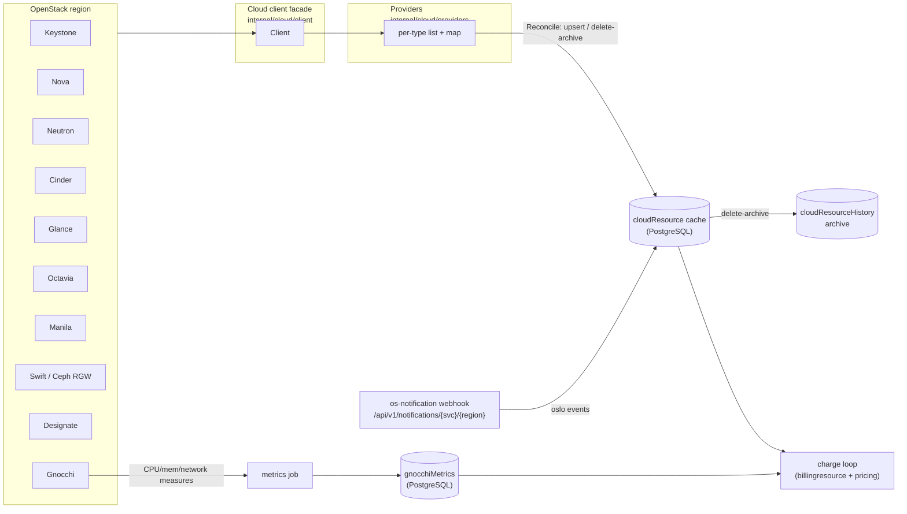
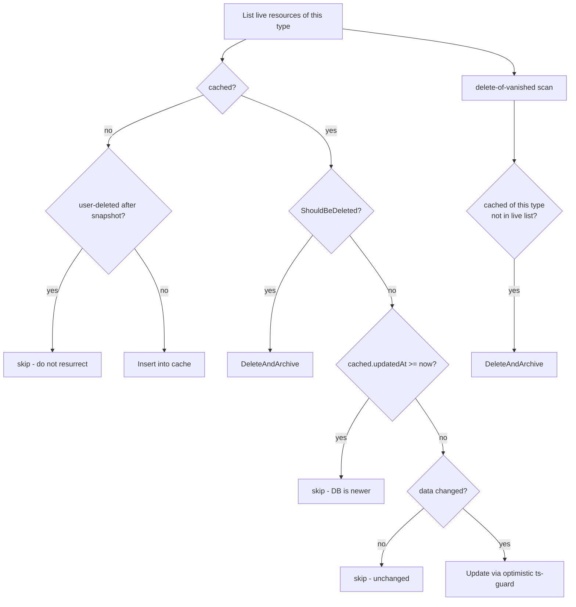
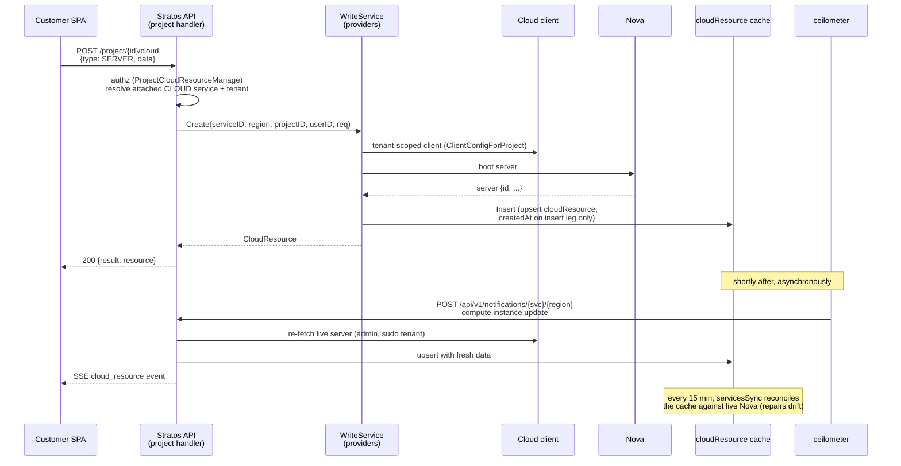

# Cloud Integration

How Stratos connects to OpenStack clouds, keeps a truthful cache of every
customer's cloud resources, and feeds that cache into billing.

This document is for contributors working in `internal/cloud/*` and
`internal/platform/externalservice/*`. It describes the model as the code
implements it today.

---

## The big picture

Stratos never bills straight off live OpenStack. It maintains a PostgreSQL **cache**
of cloud resources (the `cloudResource` table) and rates against that
cache. Two independent paths keep the cache honest:

- **Sync** (`internal/cloud/syncjob`, `internal/cloud/providers`) — a periodic
  reconcile that lists live OpenStack and makes the cache match it. Slow but
  authoritative.
- **Notifications** (`internal/cloud/notification`) — a webhook fed by
  oslo/ceilometer events that applies single-resource changes in near real
  time. Fast but only fires on events.

A third path, **metrics** (`internal/cloud/metrics`, `internal/cloud/metricsjob`),
reads gnocchi usage counters (network traffic) into per-resource monthly
documents that the rating engine charges from.



---

## External services (region registration)

An OpenStack region is registered as an **external service** — a document in the
`externalService` table, modeled by
`internal/platform/externalservice/externalservice.go`.

```go
type ExternalService struct {
    ID               string
    Name             string
    DefaultPricePlan string
    Type             string          // CLOUD | CPANEL | PAYMENT
    Status           string          // PUBLIC | PRIVATE | DISABLED
    Config           map[string]any  // free-form: identityUrl, provider, regions, services, auth...
    Secret           any             // encrypted at rest, decrypted in memory on read
}
```

Only `Type == "CLOUD"` matters to the cloud layer. The `Config` sub-document is
free-form; typed accessors over the known keys live on the struct:

| Accessor | Config key | Meaning |
|---|---|---|
| `IdentityURL()` | `config.identityUrl` | Keystone auth URL, normalized to end in `/v3` |
| `Provider()` | `config.provider` | `openstack` (Keystone-backed) **or** `ceph-s3` (see [Ceph RGW S3](#ceph-rgw-s3-object-storage-a-second-object-store-backend)) |
| `IsCephS3()` | `config.provider == "ceph-s3"` | a Keystone-free object-store-only provider |
| `Shared()` | `config.shared` | region shared with other tenants (affects the portal menu) |
| `GnocchiGranularity()` | `config.gnocchiGranularity` | measure granularity, default `300` |
| `RegionNames()` | keys of `config.regions` | the regions this service serves |
| `auth()` | `config.auth` | credential assembly (see below) |

### Credentials

Secrets are stored encrypted at rest and decrypted in place when the service
is loaded (`Service.decrypt` in `externalservice/service.go`, which walks the
free-form sub-documents and decrypts textual leaves). Never serialize `Secret` —
its JSON tag is `-`.

`ClientConfig(region)` assembles a `client.Config` from the decrypted service.
Two auth modes, selected by `config.auth.adminAuthType`:

- **`application_credential`** → `applicationCredentialId` + the decrypted
  `applicationCredentialSecret`. Pre-scoped; cannot be re-scoped to a tenant.
- **password** (default) → `adminUsername` / decrypted `adminPassword`, scoped
  by `adminProjectId` (wins) or `adminProjectName` + `adminDomainName`.

Because the service account is cloud-admin, `ClientConfigForProject(region,
externalProjectID)` re-scopes a **password** client into any tenant project by
id — this is how the platform creates and lists resources *inside* a customer's
tenant.

### Per-service toggles and the customer portal

`config.services` is a nested map of `service-name → { region → bool }`. It
drives what the customer sees. `uiMenuItems` in
`internal/platform/project/clientcloud.go` builds the portal's left-nav menu:

- for each **non-disabled** CLOUD service whose `Provider()` is `openstack`
  **or** `ceph-s3`,
- for each `config.services[name]` that has **at least one region set to
  `true`**, emit a menu item for that service-name (compute/nova,
  volume/cinder, network/neutron, load-balancer/octavia, shares/manila,
  object-store/swift, dns/designate, orchestration, container-infra, …). A
  `ceph-s3` service serves only `object-store`, so it contributes just the
  Object storage entry.

Consequences a contributor should know:

- A service-name with every region toggled off is **omitted** from the menu.
- A service with `Status == "DISABLED"` (`IsDisabled()`) contributes **no** menu
  items and is skipped by sync and the charge loop.
- When the region is `Shared()`, `container-infra`, `object-store`, and
  `orchestration` are forced disabled in the menu even if toggled on.
- `projectServices` (GET `/{projectId}/service`) returns the CLOUD services
  actually **attached** to a project — empty until the project is bootstrapped
  onto a service.

So "enabling a service" is a config toggle on the external service; "attaching"
a project happens at bootstrap (a Keystone tenant is created and its id recorded
on the project per service).

---

## The cloud client layer

`internal/cloud/client` is the OpenStack facade. It hides the SDK
(`gophercloud/v2`) and the direct-REST transport from every layer above it, so
providers, sync, and metrics never import gophercloud.

- **Identity (Keystone v3)** — `New(ctx, Config)` authenticates
  password-or-application-credential, project-scoped, with automatic reauth
  (`AllowReauth`). `identity.go` holds the admin project ops used by
  provisioning: `CreateProject`, `FindProjectByTag`, `ListAllProjects`,
  `FindUserID`/`FindRoleID`, `GrantProjectUserRole`.
- **Typed clients** — Nova (`ListServers`, `ListFlavors`, `GetVNCConsole`,
  server actions), Neutron (`ListNetworks`, `ListPorts`, floating IPs, security
  groups, routers), Glance (`ListImages*`, `GetImage`, upload/delete), plus
  Octavia, Manila, Designate, Barbican, Heat, Magnum, Swift/RGW in the sibling
  files (`loadbalancer.go`, `share.go`, `dns.go`, `objectstore.go`, `stack.go`,
  `magnum.go`, …).
- **Direct REST** — `Do(ctx, method, url, body, out, okCodes...)` runs an
  authenticated call for services gophercloud has no typed client for. Gnocchi
  (metric service) and Swift/RGW go through this. `EndpointURL(serviceType)`
  resolves a service endpoint from the token catalog.

### Tenant scoping is a correctness requirement

The service account is cloud-admin, so an unscoped Neutron/Glance list returns
**every** tenant's resources. Two guards prevent cross-tenant pollution:

1. The client is built scoped to the project's tenant
   (`ClientConfigForProject`), and `Client.projectID` is passed as a
   `project_id`/`owner` filter on list calls (see `ListPorts`,
   `ListFloatingIPsFull`, `ListImagesOwned`).
2. Neutron providers additionally post-filter mapped results by
   `tenant_id == externalProjectId` (a second layer; see
   `providers/neutron_sync.go`).

Getting this wrong over-bills a customer for resources that are not theirs.

### Project provisioning

Bootstrapping a project creates a Keystone tenant tagged
`provisioner:stratos` + `stratos_project_id:<id>` (`CreateProject` in
`identity.go`). The tag is the idempotency key: `FindProjectByTag` lets re-enable
find the existing tenant instead of creating a duplicate.

---

## Resource sync (reconcile)

The cache is the `cloudResource` document
(`internal/cloud/resource.go`). `type` is the sole discriminator for the
free-form `data` sub-document (40 resource types — SERVER, VOLUME, NETWORK,
PORT, FLOATING_IP, LOAD_BALANCER, IMAGE, SHARE, BUCKET, DNS_ZONE, …).

### Providers

A **Provider** (`internal/cloud/providers/providers.go`) is the read interface for
one resource type: `List(ctx)` returns cloud objects already mapped to
`CloudResource` (externalId/type/region/data set). Optional capabilities:

- `ProjectScoped` — the Stratos project id, used to scope the delete-of-vanished
  scan to `(serviceId, projectId, type)`.
- `Deletable` — `ShouldBeDeleted(cr)` marks a cached resource terminal even when
  the cloud still lists it (e.g. a Nova server in status `DELETED`).
- `KeyedComparer` — a per-key comparison (number-width and list-order tolerant)
  for deciding whether an update is needed.

`syncjob.ProvidersFor` is the **canonical** per-project provider set —
server, port, volume, floating-ip, load-balancer, barbican, bucket, dns-zone,
the neutron types (network/router/subnet/security-group), owner-filtered image,
volume-snapshot, server-group, stack, share. Every sync path uses it, so all
paths reconcile with identical scoping and leak-guards.

### Reconcile algorithm

`providers.Reconcile(ctx, provider, repo, serviceID, now)` is the core. For each
live resource:



Key behaviors, all in `providers/providers.go` + `cloud/repo.go`:

- **Leak-guard / delete-of-vanished** — after upserting, the reconcile scans the
  cached resources of this `(serviceId, projectId, type)` and archives any not
  present in the live list. Scoping to `projectId` (via `ProjectScoped`) means
  one project's sync can never delete another project's cached resources that
  share a `serviceId`.
- **Recreate guard** (`WasUserDeletedAfter`) — if the newest archive record for
  `(serviceId, externalId)` was deleted **after** this sync's snapshot time, the
  resource is *not* re-inserted from a stale cloud read.
- **Optimistic concurrency** — `Update` runs a row-locked read-modify-write
  inside a transaction (`WithTx` + `GetForUpdate`), gated on
  `updatedAt <= incoming.updatedAt` (compared in Go); a newer DB doc wins and the
  write is skipped (`Update` returns `(nil, nil)`).
- **Immutable `createdAt`** — `createdAt` is written only on the insert leg (never
  on an update), so re-caching never drifts it. This matters: the UI
  "Created" column and mid-month billing proration both read it.
  `StampCreatedAtIfNull` heals docs whose `createdAt` was nulled by older
  writers.
- **`data` map stability** — cached `data` maps must be JSON-round-trip-stable.
  Timestamps inside `data` are kept as RFC3339 **strings**, never `time.Time`
  (a `time.Time` in a free-form map serializes to an RFC3339 string and decodes
  back as a `string`, not a `time.Time`, so the keyed compare would report a
  spurious diff every pass → update churn — see
  `imageToMap` in `client/client.go`).

### History archive

`DeleteAndArchive` hard-deletes from `cloudResource` and writes a one-time copy
into `cloudResourceHistory` (`internal/cloud/history.go`). The archive is
idempotent per `cloudResourceId` and copies only
`cloudResourceId/region/serviceId/type/data/createdAt/externalId/projectId +
deletedAt`. History backs the recreate guard above.

### The sync job

`internal/cloud/syncjob/job.go` walks work:

- `Run(ctx)` — every **ENABLED** project → each attached CLOUD service → each
  region → `ProvidersFor(...)` → `Reconcile`. Returns total created+updated.
  Per-project / per-service failures are logged and skipped.
- `SyncOne(ctx, projectID, serviceID)` — the admin single-project leg. Blank
  `serviceID` syncs every attached service (gated on the project being ENABLED);
  a specific `serviceID` syncs just that one.

A project with no `externalProjectId` for a service is **skipped**, not synced
with an admin-wide client — that would pull the whole region into one project.

---

## Notifications (the fast path)

`internal/cloud/notification` ingests oslo/ceilometer events so the cache stays
consistent *between* sync passes.

- **Endpoint** — `POST /api/v1/notifications/{externalServiceId}/{region}`
  (`notification/handler.go`). This is the "Notifier URI" configured in
  OpenStack. It is `permitAll` (ceilometer cannot present a bearer token) but
  fails closed on a shared secret: a missing/wrong `X-Stratos-Notification-Secret`
  gets a `401` **before** any cache mutation (`handler.go`, `authorized`). Once
  authorized it **always returns 200** — a processing error must not make
  OpenStack retry-storm. A malformed body is the one 400.
- **Routing** — `TypeForEvent` maps the first dot-segment of `event_type` to a
  resource type: `compute.*` → SERVER (or BAREMETAL_SERVER via the flavor
  check), `volume.*` → VOLUME, `network.*` → NETWORK, `floatingip.*` →
  FLOATING_IP, `image.*` → IMAGE, `dns.*` → DNS_ZONE, `router.*`,
  `subnet.*`, `port.*`, `security_group.*`, `orchestration.*` → STACK,
  `magnum.*` → KUBERNETES_CLUSTER, `share.*`. Unmapped prefixes are skipped.
- **Decision** — `minimalInfo` extracts the resource id + tenant id from the
  payload. The internal project is resolved by external project id (else by an
  existing cached resource). Then:
  - an event whose type contains `delete`, **or** a re-fetch that 404s →
    `DeleteAndArchive`;
  - otherwise the live object is re-fetched (admin-scoped, sudo to the tenant)
    and upserted (`FetchByType` in `fetcher.go` wraps it in the cache's `data`
    shape, e.g. `{server:{…}}`).

Which events matter: instance / volume / network / port / floating-ip / router /
image / dns lifecycle — the create/update/delete of the billable and
user-visible resource types. After a notification is applied, an SSE event is
pushed to the project's open streams (best-effort; see the SSE note in
`jobs-scheduling.md`).

**Notifications vs sync:** notifications are the low-latency single-resource
fast path (event-driven, no polling); the sync job is the periodic full
reconcile that repairs anything notifications missed (dropped events, resources
created out-of-band). Both write the same cache through the same repo.

---

## Metrics (gnocchi usage)

`internal/cloud/metrics` reads gnocchi measures; `internal/cloud/metricsjob`
drives the ingestion. Today's scope is **network traffic** per server.

- `metrics/gnocchi.go` is a direct-REST client (gophercloud has no metric
  client). `SearchInstanceInterfaces` finds a server's network-interface
  resources; `MeasuresMBForCurrentMonth` returns billable traffic for the month
  as `(max − min) / 1048576` MB over the cumulative counter, using 16-sig-digit
  half-even division so the number matches the rating engine's arithmetic
  exactly.
- `metrics/service.go` aggregates per server: for each interface, sum
  incoming/outgoing bytes into **public vs private** buckets (`isPublicTraffic`
  classifies by the interface's port → its network → whether that network is in
  the region's `router:external` set), then upserts the month's `GnocchiMetrics`
  document (`metrics/domain.go`).
- `metricsjob/job.go` (`Run`) walks every **ENABLED** project, reads its cached
  SERVER + PORT resources, resolves each server's external service, and calls
  `FetchAndSaveGnocchiMetrics`. Per-project / per-server failures are logged and
  skipped.

`GnocchiMetrics` is one document per `(resource, billing cycle)` holding the
month's accumulated usage. The charge loop reads it: the SERVER billing provider
(`billingresource`) turns cached traffic + flavor specs into priced attribute
values. Customers see the resulting usage/traffic on the server detail views;
the direct instance CPU/memory/network **charts** action (`METRICS` on the
client cloud path) is not wired through the client surface yet — see the extension point in
`internal/platform/project/cloud_writes.go`.

---

## How the cache feeds billing

`internal/cloud/billingresource` is the cloud → billing bridge.
`GetBillingResources(projectID, serviceID)` lists the service's cached resources
and flat-maps each through its type's **Provider**
(`GetBillingInformation`) into priced `BillingResource`s. Types with no
registered provider are skipped (only billable types contribute). The registered
providers today are SERVER, VOLUME, FLOATING_IP, and LOAD_BALANCER (wired in
`cmd/api/main.go`).

`stampResourceValues` injects `region` and `service_id` into each billing
resource's values (so a price-plan rule filtered by region/service can match)
and stamps `createdAt` (which drives mid-month proration).

The charge loop itself (`internal/platform/billingjob`) reads **only** the PostgreSQL
cache — `cloudResource` + `gnocchiMetrics` + price plans — never live cloud. That
is why the whole rating driver is testcontainer-verifiable, and why sync +
metrics exist: to keep the cache truthful so the numbers the loop charges are
real. See `jobs-scheduling.md` for the charge cadence and distributed-lock model.

---

## Sequence: a customer creates a server



The create writes OpenStack **and** the cache synchronously, so the SPA sees the
resource immediately. Notifications then keep it fresh as the server transitions
(BUILD → ACTIVE), and the periodic sync repairs anything the event stream
missed.

---

## Ceph RGW S3 object storage (a second object-store backend)

Everything above describes an **OpenStack** provider (`config.provider == "openstack"`),
where object storage rides on Swift inside a Keystone tenant. Stratos also supports a
second, independent object-store backend: **Ceph RGW over the S3 API**
(`config.provider == "ceph-s3"`). The two run **side by side, permanently** — they are two
disjoint sets of buckets, never migrated between — so the UI labels every bucket with its
backend (`data.storageBackend` = `SWIFT` | `CEPH_S3`) and the create form makes the user pick
one. Code: `internal/cloud/client/objectstore_ceph*.go`, `internal/cloud/cephcred/`,
`internal/platform/project/cloud_bucket_settings.go`.

### No Keystone; the RGW user is the per-project anchor

A `ceph-s3` project has **no Keystone tenant and no `externalProjectId`**. The per-project
anchor is a dedicated **RGW user**, `rgwUid = config.uidPrefix + <stratosProjectId>`, created
in RGW's **default tenant**. We deliberately do **not** use RGW multi-tenancy: a tenanted
bucket cannot be reached from the s3website endpoint (a DNS hostname cannot encode a tenant),
which would make static website hosting impossible. The trade-offs:

- **Isolation** = bucket **ownership** + S3 default-deny, plus the admin-ops `uid` filter that
  scopes the sync/billing list. A project's data-plane keys can only touch buckets it owns.
- **Global bucket namespace** (exactly like AWS S3). A name taken by any project fails with
  `409` (`client.ErrBucketNameTaken`). If collisions bite, add a per-provider `bucketPrefix`
  (not built).

### Provider config

A `ceph-s3` external service is created through the same admin `POST /service` path (no special
casing — the create path persists arbitrary `config` + encrypts `secret`). Shape:

```jsonc
{
  "type": "CLOUD", "status": "PUBLIC", "name": "ceph-s3",
  "config": {
    "provider": "ceph-s3",
    "s3Endpoint":        "https://s3.example",            // S3 data endpoint
    "adminApiUrl":       "https://s3.example/admin",       // RGW Admin Ops
    "s3WebsiteEndpoint": "https://s3-website.example",     // optional (static websites)
    "region":            "us-east-1",                       // RGW zonegroup, for SigV4
    "uidPrefix":         "dev_",                            // optional prefix on the RGW uid
    "defaultQuotaGiB":   100,                               // per-project user quota
    "services": { "object-store": { "us-east-1": true } }
  },
  "secret": { "adminAccessKey": "…", "adminSecretKey": "…" }  // an RGW admin user, caps users=*;buckets=*;usage=*
}
```

Accessors: `IsCephS3`, `S3Endpoint`, `AdminAPIURL`, `S3WebsiteEndpoint`, `CephRegion`,
`UIDPrefix`, `RGWUIDFor(projectID)`, `DefaultQuotaGiB`, and `CephConfig(...)` which assembles a
`client.CephConfig` for `client.NewCephS3`.

### Two credential planes

`client.NewCephS3` builds a `*client.Client` with **no gophercloud provider** — every OpenStack
method returns `ErrNotOpenStack` (a stub `EndpointLocator`, so a mis-routed call errors instead
of panicking). It carries up to two S3/admin clients:

- **Admin keys** (Admin Ops, SigV4-signed REST): provision the RGW user + quota, list buckets
  with stats for the sync/billing meter, read one bucket's owner/stats. An *admin-only* client
  (no project keys) can do these but no data I/O.
- **Project keys** (aws-sdk-go-v2 S3): bucket + object CRUD, ACL, website, policy — run **as the
  project's own RGW user**. Stored encrypted per project in the `cephRgwCredential` collection
  (`internal/cloud/cephcred`), kept **off** the project document (which is serialized to the
  client, so the secret would leak).

Admin Ops quirks that only a live cluster surfaced (see `tasks/lessons.md`): every request needs
an explicit `X-Amz-Content-Sha256` header; the query must be sorted (SigV4 canonicalization);
`PUT /admin/user?key` returns a **bare array**; `max-buckets=-1` **forbids** a user from creating
buckets (the opposite of the usual convention).

### Ownership guard — every admin-by-name op verifies the live owner

The admin key can address **any** bucket by name, and the namespace is global. So a stale cache
row whose name was recreated by another project must never be read, requota'd, or purged as if it
were ours. `adminBucketInfo` / `bucketOwner` fetch the live `owner` and refuse a bucket the
project does not own (`ErrBucketNotOwned`); `getBucket`, `SetBucketQuota`, and
`ForceDeleteCephBucket` all funnel through it. Cached `ProjectID` is **not** proof of live
ownership.

### Lifecycle

- **Bootstrap** (`project/bootstrap.go: BootstrapCephOnto`) — ensure the RGW user (idempotent),
  set quota, store the keys in `cephRgwCredential`, append the binding
  `{serviceId, provider:"ceph-s3", region, rgwUid}`. `enableAndBootstrap` provisions ceph-s3
  services alongside the OpenStack one on project entry.
- **Client build** — the handler seams (`tryTenantClient`, `tenantWriteService`) branch on
  `IsCephS3()` and build a project-keyed ceph client from `cephRgwCredential` (bypassing the
  Keystone `externalProjectId` gate). Bucket actions resolve the backend from the **resource's**
  `serviceId`, never the request header — Swift and ceph coexist.
- **Sync** (`syncjob.go: syncCephService`) — admin-keyed client, `uid`-scoped bucket list with
  stats → the `BUCKET` cache carries `{objectCount, sizeInBytes, sizeInGb}` (logical `size`, to
  match Swift), which the existing `"bucket"` pricing rules rate unchanged. The `uid` filter IS
  the leak-guard.
- **Teardown** (`project/teardown.go`) — force-delete this project's ceph buckets via Admin Ops
  `purge-objects` (owner-checked), purge each child-key user then the parent user, and drop the
  stored credentials. **Fail closed:** a local key/credential record is deleted only after its
  RGW user is actually purged, so a transient purge failure never orphans a live key with no
  inventory left to revoke.

### Customer surface

Beyond bucket + object CRUD (the same CloudClient methods Swift uses), ceph-s3 buckets expose an
S3 feature surface, all gated and live-verified:

- **S3 access keys** (`/project/{id}/s3-credentials`, `/s3-keys`) — the project's own credentials
  plus extra keys for aws-cli / any S3 client, with **rotation** and delete. Each extra key is
  its own RGW user (`<projectUid>-<name>`, `max-buckets=-1` so it cannot create unmetered
  buckets); it gets access only through explicit **bucket grants** (READ / READ_WRITE / FULL, via
  bucket policy). These endpoints require `project:cloud_resource:api_access`, not `manage` —
  they hand out live credentials.
- **Bucket settings** (cloud actions on the BUCKET resource) — versioning, object lock
  (create-time, **GOVERNANCE only** so teardown can still purge), per-bucket quota, lifecycle,
  CORS, tagging, raw bucket-policy passthrough, read-only index-type/placement.
- **Static website** — `PutBucketWebsite` + an anonymous-read bucket **policy** (not just an ACL;
  an ACL grants bucket *listing*, not object reads). Enabling exposes every object publicly, and
  the response says so (`publicObjects: true`).

Stratos **owns** the bucket policy document and merges by `Sid` (`StratosPublicWebsiteRead`,
`StratosPublicRead`, `StratosGrant-<uid>`), preserving foreign statements byte-for-byte — so the
website toggle and per-key grants never clobber each other or a customer's own statements.

**Not built** (blocked by infra, not code): server-side encryption (needs a KMS/Vault backend —
`PutBucketEncryption` returns 200 but then bricks writes without one), cross-zone replication
(single-zone cluster), MFA delete. See `tasks/ceph-s3-object-storage-plan.md` §10.

---

## Source files

**Cloud domain and cache:**

- `internal/cloud/resource.go` — the `CloudResource` document + the 40 types
- `internal/cloud/repo.go` — persistence, optimistic upsert/update, archive, recreate guard, counts
- `internal/cloud/history.go` — `cloudResourceHistory` archive record
- `internal/cloud/download.go` — object-store download tokens

**Client facade:**

- `internal/cloud/client/client.go` — Keystone auth + Nova/Neutron/Glance + direct-REST `Do`
- `internal/cloud/client/identity.go` — Keystone admin project/user/role ops
- `internal/cloud/client/{loadbalancer,share,dns,objectstore,stack,magnum,barbican,vpn,baremetal}*.go` — per-service clients
- `internal/cloud/client/objectstore_ceph{,_policy,_settings}.go` — the Ceph RGW S3 backend (S3 + Admin Ops, policy document, bucket settings)
- `internal/cloud/cephcred/{cephcred,s3key}.go` — per-project RGW credentials + extra S3 keys (encrypted)

**Providers and sync:**

- `internal/cloud/providers/providers.go` — Provider interface + `Reconcile`
- `internal/cloud/providers/{server,port,volume,floatingip,loadbalancer,network,neutron_sync,image_sync,niche_sync,token_sync,write}.go`
- `internal/cloud/syncjob/job.go` — the sync driver + `ProvidersFor`

**Notifications:**

- `internal/cloud/notification/{notification,handler,fetcher}.go`

**Metrics:**

- `internal/cloud/metrics/{gnocchi,service,domain,repo}.go`
- `internal/cloud/metricsjob/job.go`

**Billing bridge:**

- `internal/cloud/billingresource/{billingresource,catalog,server,volume,floatingip,loadbalancer}.go`

**External services:**

- `internal/platform/externalservice/{externalservice,service,repo}.go`

**Portal-facing:**

- `internal/platform/project/clientcloud.go` — UI menu + attached services
- `internal/platform/project/cloud_writes.go` — client cloud create/action/delete
- `internal/platform/project/cloud_bucket_settings.go` — ceph-s3 bucket settings + S3-key routes
- `internal/platform/project/{bootstrap,teardown}.go` — ceph provision + deprovision branches
- `cmd/api/main.go` — wiring (external services, cloud client, cephcred, notification fetcher/resolver, jobs)
