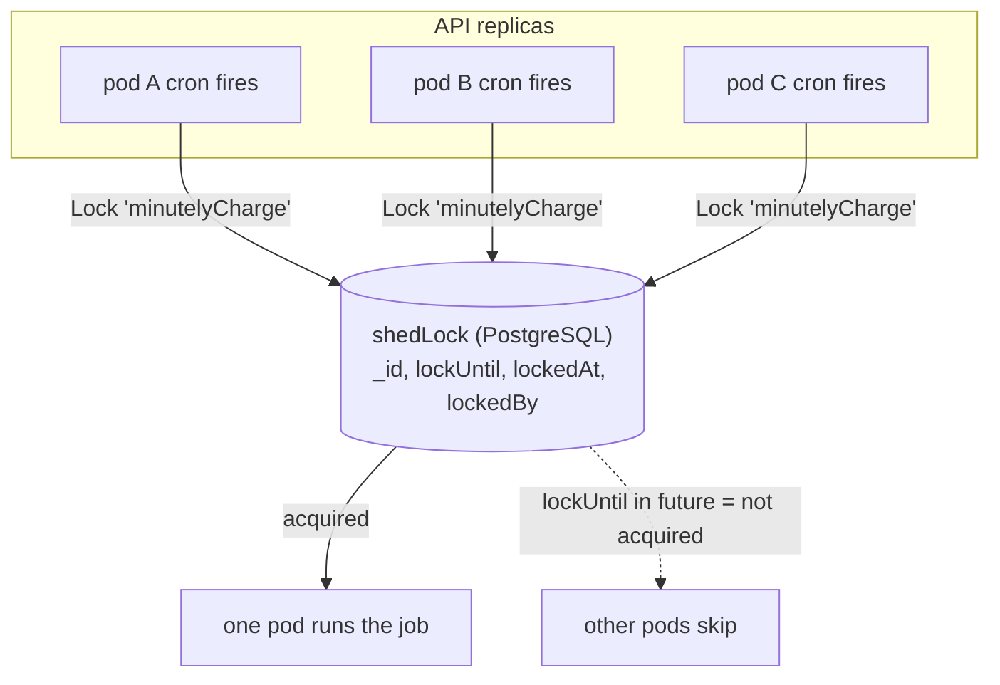
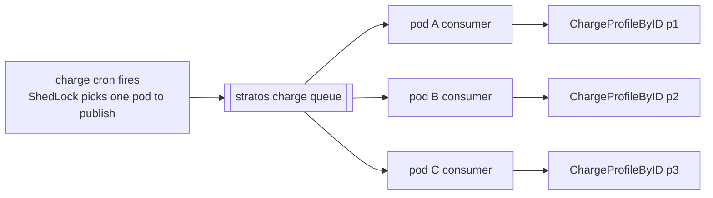
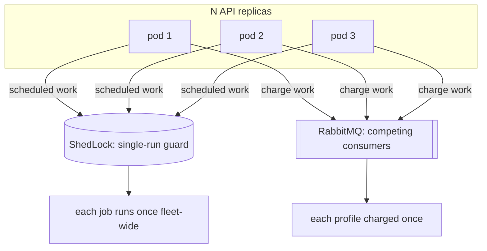

# Jobs & Scheduling

How Stratos runs its background work — cron-scheduled jobs, the distributed lock
that keeps them single-run across replicas, the optional RabbitMQ charge
fan-out, and the on-demand debug triggers.

This document is for contributors working in `internal/platform/scheduler`,
`internal/platform/lock`, `internal/platform/chargefanout`,
`internal/platform/billingjob`, and the job wiring in `cmd/api/main.go`.

---

## Why this design

The API is meant to run with **N replicas** behind a load balancer. Background
work must not multiply by the replica count — you do not want three pods each
charging every billing profile every minute. Two mechanisms make horizontal
scaling safe:

- **ShedLock** — a PostgreSQL-backed distributed lock. Every scheduled job runs
  under a named lock, so a given fire executes on exactly one pod fleet-wide.
- **Competing consumers** — the optional charge fan-out publishes one message
  per profile to a shared queue; any pod drains it, and each message is
  delivered once.



---

## The scheduler

`internal/platform/scheduler/scheduler.go` wraps `robfig/cron/v3` in
**seconds-enabled** mode, so all cron specs are **6-field, seconds-first**
(`sec min hour dom month dow`).

A job is:

```go
type Job struct {
    Name       string        // the ShedLock name
    Spec       string        // 6-field cron expression
    AtMostFor  time.Duration
    AtLeastFor time.Duration
    Fn         func(ctx context.Context)
}
```

`Register` schedules the job; each fire calls `RunLocked`, which acquires the
job's ShedLock, runs `Fn` only if it acquired, and releases honoring
`AtLeastFor`:

```go
func (s *Scheduler) RunLocked(ctx, name, atMostFor, atLeastFor, now, fn) (bool, error) {
    ok, err := s.lock.Lock(ctx, name, atMostFor, now)
    if err != nil || !ok { return false, err }   // a fleet-mate holds it -> skip
    defer s.lock.Unlock(ctx, name, atLeastFor, now, time.Now().UTC())
    fn(ctx)
    return true, nil
}
```

`RunLocked` is exported with an injected `now` so the lock guard is
deterministically testable without waiting on the cron clock.

---

## ShedLock (the distributed lock)

`internal/platform/lock/shedlock.go`. One row per lock in the `shedLock`
table `(id text primary key, doc jsonb)`:

```text
{ _id: <lockName>, lockUntil: <time>, lockedAt: <time>, lockedBy: <hostname> }
```

**Acquire** — `Lock(name, atMostFor, now)` runs a single statement, and treats
`RowsAffected() > 0` as acquired:

```sql
INSERT INTO "shedLock" (id, doc)
VALUES (name, { lockUntil: now + atMostFor, lockedAt: now, lockedBy: host })
ON CONFLICT (id) DO UPDATE SET doc = EXCLUDED.doc
WHERE ("shedLock".doc->>'lockUntil')::timestamptz <= now;
```

- If no lock row exists, the `INSERT` creates it → **acquired**.
- If a row exists but its `lockUntil` is in the past, the `ON CONFLICT` arm's
  `WHERE` guard passes and the row is taken over → **acquired**.
- If a live lock is held (`lockUntil > now`), the `WHERE` guard fails, zero rows
  are affected → **not acquired** (returns `false`, no error).

`atMostFor` (ShedLock's `lockAtMostFor`) is the **safety ceiling**: if the
holder crashes without unlocking, the lock auto-frees after this long so the job
is not stuck forever.

**Release** — `Unlock(name, atLeastFor, acquiredAt, now)` sets `lockUntil` to
the later of `acquiredAt + atLeastFor` and `now`. `atLeastFor`
(`lockAtLeastFor`) is a **minimum hold**: a job that finished in milliseconds
still can't re-run before its minimum interval, which debounces a fast job whose
cron would otherwise fire it again immediately.

---

## Job catalog

These are the jobs registered in `registerJobs` (`cmd/api/main.go`), with the
cron specs from `scheduler.go`. All specs are 6-field seconds-first, UTC.

| Job (lock name) | Cron spec | Cadence | atMostFor / atLeastFor | What it does |
|---|---|---|---|---|
| `minutelyCharge` | `30 * * * * *` | every minute at :30 | 5m / 30s | Charge each ACTIVE billing profile for the `minute` time unit |
| `hourlyCharge` | `0 0 * * * *` | top of every hour | 5m / 30s | Charge each ACTIVE profile for the `hour` time unit |
| `monthlyCharge` | `0 0 * * * *` | top of every hour | 5m / 30s | Charge each ACTIVE profile for the `month` time unit (shares the hourly spec; the charge filters rules by exact time unit) |
| `gnocchiMetricsFetch` | `0 0 * * * *` | top of every hour | 10m / 30s | Ingest network-traffic usage into `gnocchiMetrics` from the provider's metrics source (`config.metrics.source`: gnocchi default, `prometheus` for a Prometheus/Mimir endpoint, `none` skips the provider) |
| `savingsContractExpiration` | `0 0 0 * * *` | daily 00:00 | 10m / 30s | Expire savings contracts past their end date |
| `savingsContractExpiryReminders` | `0 0 0 * * *` | daily 00:00 | 10m / 30s | Schedule reminder docs for ACTIVE contracts nearing expiry |
| `reminderNotifications` | `0 0 * * * *` | top of every hour | 10m / 30s | Dispatch the due scheduled reminders (re-evaluates days-until-expiry each run) |
| `paymentGatewayTransactionScanning` | `0 */20 * * * *` | every 20 minutes | 10m / 30s | Reconcile stuck PENDING payment transactions (deposits/collects) |
| `autoSuspensionJob` | `0 */30 * * * *` | every 30 minutes | 20m / 5m | Run dunning → auto-suspend delinquent billing profiles |
| `monthlyBill` | `0 0 0 * * *` | daily 00:00 | 1h / 30s | Finalize each profile's previous-month OPEN bill (OPEN → SENT/PAID) so it becomes collectable + dunnable |
| `monthlyCollect` | `0 0 7 1,5,9,13,16 * *` | 07:00 on the 1st/5th/9th/13th/16th | 1h / 30s | Collect SENT bills via the stored card |
| `servicesSync` | `0 */15 * * * *` | every 15 minutes | 10m / 30s | Sync every ENABLED project's cloud resources into the cache |
| `executeProjectDeletion` | `30 * * * * *` | every minute at :30 | 1m / 30s | Delete projects past their deletion grace window (cascade live cloud delete → remove the doc) |

Notes:

- `monthlyCharge` deliberately reuses the hourly spec. The charge step filters
  price-plan rules by the **exact** time unit, so a `month`-unit rule only
  accrues on the monthly charge even though it fires hourly.
- The `autoSuspensionJob` uses a longer `atLeastFor` (5m) because dunning + cloud
  suspend is heavier and should not re-fire back-to-back.
- Every job body logs-and-continues on error; the scheduler never crashes on a
  job failure.

### The charge job specifically

`internal/platform/billingjob/billingjob.go` is the rating driver. `Charge(ctx,
timeUnit, now)`:

1. gates on `billingEnabled` (a `billingConfiguration` document exists);
2. loads all **ACTIVE** billing profiles + every external service;
3. for each profile, gathers the project-scoped cached resources per service,
   selects applicable price-plan rules for the time unit, and applies them to
   the profile's current bill (plus savings-contract discounts and
   price-adjustment rules).

Errors per profile are logged and skipped so one bad profile can't stall the
rest. Crucially, the charge reads **only** the PostgreSQL cache
(`cloudResource` + `gnocchiMetrics` + price plans), never live cloud — the sync
and metrics jobs are what keep that cache truthful (see
`cloud-integration.md`).

---

## Charge fan-out (the RabbitMQ alternative)

By default the charge cron runs **in-process**: one pod acquires the
`minutelyCharge`/`hourlyCharge`/`monthlyCharge` lock and loops over every ACTIVE
profile itself. That's simple and correct, but a slow or failing profile is
processed on the same goroutine as the rest, and all the work lands on one pod.

`internal/platform/chargefanout/chargefanout.go` is the opt-in alternative. When
`STRATOS_JOBS_RABBIT_FANOUT=true`, the cron **publishes** instead of looping:

- `Publish` fans out one message per ACTIVE profile to the shared queue
  `stratos.charge`. Each message is `{ profileId, timeUnit }`.
- Every pod runs a `StartConsumer` that drains the queue, calling
  `billingjob.ChargeProfileByID` — the **same** per-profile work as the
  in-process loop — for one profile per message.



Why you'd turn it on:

- **Failure isolation** — a slow/failing profile is one message; it cannot stall
  the others.
- **Spread** — work distributes across all pods, not one.
- **Idempotent unit** — `ChargeProfileByID` no-ops if the profile vanished or is
  no longer ACTIVE since the message was published.

The charge math is identical either way — only the dispatch differs. `main.go`
wraps this in `chargeDispatch`: if fan-out is on and the broker is connected it
publishes, otherwise it falls back to charging in-process for that tick (so a
missing broker never silently drops a billing run).

---

## Manual triggers

Two ways to run a job on demand instead of waiting for its cron — useful for a
controlled first live run, or for driving a job deterministically in a drill.

### mgmt debug triggers

Exposed on the **management port** when `STRATOS_JOBS_SCHEDULER_ENABLED=true`
**or** `STRATOS_JOBS_DEBUG_TRIGGERS=true` (`server.MgmtRouter(..., jobsDebug)`).
Each is `POST /debug/<name>` and returns a small JSON result (the sole exception
is the read-only `GET /debug/cloud` connectivity probe):

| Trigger | Runs |
|---|---|
| `run-sync` | one cloud resource sync pass |
| `run-metrics` | one metrics ingestion pass (gnocchi or prometheus per provider config) |
| `run-charge?timeUnit=minute\|hour\|month` | one charge pass (defaults to `minute`) |
| `run-savings-expire` | expire savings contracts |
| `run-expiry-reminders` | schedule expiry reminder docs |
| `run-reminders` | dispatch due reminders |
| `run-txn-scan` | scan stuck PENDING transactions |
| `run-review` | re-evaluate every profile's suspension (resume path) |
| `run-dunning` | dunning → auto-suspend |
| `run-send-bills` | finalize previous-month OPEN bills |
| `run-collect` | collect SENT bills via card |
| `run-project-deletion` | delete scheduled projects (⚠ live cloud deletes) |
| `run-charge-fanout` | publish the charge work-list to RabbitMQ |
| `rabbit-selftest` | prove Publish+Consume round-trip against the broker |
| `sse-emit` | push a synthetic SSE event to open streams |
| `send-test-mail` | render + send a system message template |
| `gen-hmac-key` | mint an Admin-API SigV4 access key pair |

### Operator job API

`internal/platform/job` also exposes `/api/v1/admin/job/*` on the app port,
reusing the **same** in-process job objects (charge, metrics, services-sync,
collect, savings-expire, reminder schedule/dispatch, transaction-scan). This is
the authenticated operator surface for the same runners.

---

## Wiring and startup gates (`cmd/api/main.go`)

Jobs are **always wired** but **started only when enabled**, so a plain deploy
never charges bills unexpectedly:

```go
if cfg.Jobs.SchedulerEnabled {   // STRATOS_JOBS_SCHEDULER_ENABLED
    sched.Start()                // crons begin firing
    defer sched.Stop()
} else {
    // wired but dormant
}
```

The three env gates (`internal/config/config.go`):

| Env var | Effect |
|---|---|
| `STRATOS_JOBS_SCHEDULER_ENABLED` | Start the cron scheduler (jobs begin firing on their specs). |
| `STRATOS_JOBS_DEBUG_TRIGGERS` | Expose the mgmt `/debug/run-*` triggers even when the scheduler is off. |
| `STRATOS_JOBS_RABBIT_FANOUT` | Route the charge cron through the RabbitMQ fan-out; also starts a charge consumer on this pod. |

When fan-out is on, `startChargeConsumer` waits (bounded) for the
background-maintained broker connection, then subscribes this pod's consumer —
so startup never blocks on the broker.

---

## Scaling implications

Run N replicas freely:

- **Scheduled jobs** are safe because every fire goes through ShedLock —
  fleet-wide, exactly one pod runs a given job per fire. `atMostFor` bounds a
  crashed holder; `atLeastFor` debounces fast jobs.
- **Charge fan-out** is safe because RabbitMQ delivers each per-profile message
  to exactly one consumer (competing consumers), and `ChargeProfileByID` is
  idempotent against a stale message.



**Known multi-replica consideration — SSE is per-pod.** The real-time event
stream (`internal/platform/sse`) is an **in-memory pool per pod**
(`sse.NewPool()` in `main.go`). A browser is connected to whichever pod
terminated its stream; an event pushed on another pod (e.g. from an
os-notification received there, or a `sse-emit` trigger) reaches only the
subscribers on **that** pod. This is fine when a load balancer pins the SSE
connection to one pod, but a contributor adding cross-pod real-time delivery
would need a shared broadcast (e.g. a RabbitMQ fan-out topic) rather than the
current in-process pool. The scheduled jobs and charge fan-out are unaffected —
only live SSE delivery is pod-local.

---

## Source files

- `internal/platform/scheduler/scheduler.go` — cron specs, `Job`, `Register`, `RunLocked`
- `internal/platform/lock/shedlock.go` — the PostgreSQL distributed lock (acquire/release)
- `internal/platform/chargefanout/chargefanout.go` — RabbitMQ charge fan-out (Publish / StartConsumer)
- `internal/platform/billingjob/billingjob.go` — the charge/rating driver (`Charge`, `ChargeProfileByID`, `ActiveProfileIDs`)
- `internal/cloud/syncjob/job.go` — the `servicesSync` job
- `internal/cloud/metricsjob/job.go` — the `gnocchiMetricsFetch` job
- `internal/platform/job/*` — the `/api/v1/admin/job/*` operator API
- `internal/config/config.go` — the `STRATOS_JOBS_*` env gates
- `cmd/api/main.go` — `registerJobs`, `chargeDispatch`, `startChargeConsumer`, the mgmt debug triggers, and the enable/start gating
