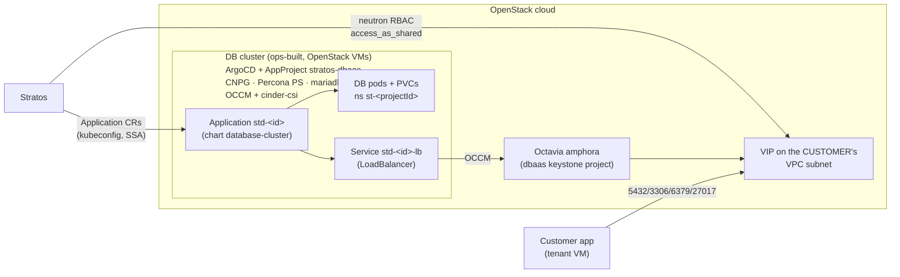
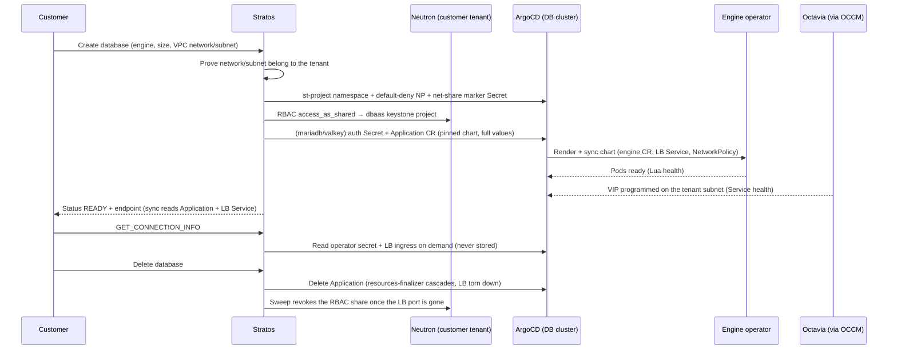

# Managed Databases (DBaaS) — operator guide

Stratos provisions customer databases as **ArgoCD Applications on a dedicated, ops-built DB
Kubernetes cluster** — the managed-Kubernetes (kamaji) delivery pattern pointed at a different
cluster. One database = one Application rendering the `database-cluster` chart
(`deploy/charts/database-cluster`), which emits the engine operator CR, a tenant-facing Octavia
LoadBalancer Service and a NetworkPolicy. Stratos stays stateless about desired spec: the
Application's `helm.valuesObject` is the state store, status is read back off Application
health + the LB Service.

Engines (all five ship in the chart; valkey is beta-gated):

| Engine | Operator | HA semantics | Client port |
|---|---|---|---|
| `postgresql` | CloudNativePG ≥ 1.29.1 | `instances` 1/2/3, operator failover | 5432 |
| `mysql` | Percona Operator for MySQL (PS) | group replication, size 1 or 3 | 3306 |
| `mariadb` | mariadb-operator 26.x | replication + chart-owned HAProxy | 3306 |
| `valkey` | valkey-operator (pre-GA, **beta**) | 1 shard, `instances`-1 replicas | 6379 |
| `ferretdb` | FerretDB v2 over a CNPG backend | CNPG instances + stateless frontends | 27017 |
| `opensearch` | opensearch-k8s-operator 3.0.2 | N same-size nodes (all roles), 1 or 3 | 9200 (HTTPS) |
| `kafka` | Strimzi 1.1.0 (KRaft, Kafka 4.2.0–4.3.0) | dual-role KRaft pool, 3 brokers | 9094 (SASL/SCRAM) |

Unlike managed-k8s, the compute/storage under a database is **ops-owned** — nothing lands in
the customer tenant except the LB VIP. Billing therefore carries the full price on the
`database_cluster` resource type (pre-multiplied totals `vcpus_total`/`ram_gb_total`/
`storage_gb_total`). While the endpoint is absent the charge is **deferred, not waived**:
once the Octavia VIP appears the engine back-bills the current cycle's elapsed hours from
creation.

## Cluster prerequisites (ops, out-of-band)

Everything in `deploy/dbaas-cluster/` — apply order, RBAC + kubeconfig recipe, AppProject
`stratos-dbaas`, `argocd-cm` Lua health checks for the engine CRDs, the pinned operator install
list, and the Octavia/amphora quota math live there. Assumed pre-existing on the cluster:
openstack-cloud-controller-manager (Octavia LBs), cinder-csi + a default StorageClass, ArgoCD
(self-syncing) in `argocd`.

The Lua health checks are load-bearing: the LB Service's built-in health keeps an Application
`Progressing` until the Octavia VIP is programmed, so Stratos never reports READY without an
endpoint — and a missing engine-CRD check would leave Applications Healthy while the database
is degraded.

Optional, only for the DNS/TLS features (§ Provider registration): **external-dns** watching
Services (publishes `<id>.<zone>` A records off the chart-stamped hostname annotations) and
**cert-manager** with a ClusterIssuer that solves **DNS-01** for the zone (the VIPs are private
tenant-subnet IPs — an HTTP-01 challenge can never reach them).

`deploy/dbaas-cluster/README.md` carries the full CRD table — every `apiVersion/Kind` this chart
can render, audited against a live cluster. Two are easy to miss because nothing fails at
render time, only at sync: **`plugin-barman-cloud`** (the `barmancloud.cnpg.io` ObjectStore that
postgresql/ferretdb backups reference) and **valkey-operator**, which upstream ships as a raw
`install.yaml` with no helm chart, so it is vendored in infra-ops rather than mirrored.

## Provider registration

Admin UI → System → Cloud providers → Add provider → **Database (DBaaS)**, or `POST
/api/v1/admin/service` with the doc shape documented in
`internal/platform/externalservice/dbaas.go` (`config.provider = "dbaas"`). Fields that matter:

- `secret.kubeconfig` — the DB cluster kubeconfig from `deploy/dbaas-cluster/rbac.yaml`'s
  recipe (token or client-cert only; encrypted at rest, stripped from admin reads).
- `config.argocd.*` — namespace/project/chartRepo/`chartVersion` (pinned, never latest).
- `config.database.osServiceId` / `osProjectId` — the OpenStack service the DB cluster's nodes
  live on and the **dbaas keystone project id** there: the neutron-RBAC `target_tenant` every
  customer network is shared with.
- `config.database.memberSubnetId` — the DB-cluster node subnet
  (`loadbalancer.openstack.org/member-subnet-id` on every LB).
- `config.database.engines` — the curated catalog (versions / default / replicas / `beta`).
  Replica choices default to `[1, 3]` (single node or the HA trio) and are capped at 3
  platform-wide; the admin form restricts them per engine with an `@` suffix
  (`kafka=4.3.0@3`). More than 3 is a deliberate future release, not a config knob.
- `config.database.scheduling` (optional) — `{nodeSelector, tolerations}`, applied to **every**
  pod a database runs: the engine instances, the haproxy proxies (mysql/mariadb) and the FerretDB
  frontend. The point is a dedicated database node pool — label + taint it, set both halves, and
  the pool scales on database demand alone instead of competing with whatever else the DB cluster
  runs. Set BOTH: a selector alone still lets other workloads onto the pool, a toleration alone
  does not keep database pods on it. Admin form grammar: `label=value` per line for the selector,
  `key=value:Effect` / `key:Effect` / `key` per line for tolerations (the `kubectl taint`
  spelling). Kafka differs in shape only — Strimzi's pod template has no `nodeSelector`, so the
  chart renders the selector as an equivalent required `nodeAffinity`. Applied at create; an
  existing database keeps the placement stored on its Application. Needs chart ≥ 0.5.0.
- `config.database.dnsZone` (optional) — platform DNS: every database gets `<id>.<zone>`
  (`-dash` for Dashboards, `-b<N>` per kafka broker — kafka brokers then advertise those names)
  as an A record to its private VIP, and connection info returns the name instead of the IP.
  The cached endpoint and `GET_CONNECTION_INFO` both spell it through one helper
  (`Config.PublicHost`: customer domain > platform name > VIP), so the list and the connection
  panel can never disagree; the raw VIP stays available as `endpoint_ip` (what a BYO domain's
  A record must target). The name only appears once the VIP exists — the billing eligibility
  gate is unchanged.
- `config.database.certIssuer` (optional, with `dnsZone`) — cert-manager ClusterIssuer name;
  OpenSearch API + Dashboards then serve a real certificate (`<id>-tls`) for the platform name
  instead of the operator's self-signed pair. Other engines are raw TCP — an A record is all
  they need.
- `config.database.backup` (optional) — the object store every database on this location backs
  up to: `{endpoint, bucket, prefix?, region?, pathStyle}` plus `secret.backupAccessKey` /
  `secret.backupSecretKey`. Customers never see or choose it; they only turn backups on. Empty
  bucket/endpoint = the whole backup surface stays hidden client-side rather than offering a
  toggle that would write nowhere.
- `config.services.database.<region> = true` — un-hides the client Databases surface.

Seed example: `deploy/seed/external-service-dev.json` (`svc-dbaas-dev`).

## Networking (why neutron RBAC)

The OCCM on the DB cluster authenticates as the ops-owned dbaas keystone project; for it to
plant an Octavia VIP on a customer subnet, the customer network must be visible to that
project. At database create Stratos verifies the customer owns the network/subnet, then creates
a neutron RBAC policy (`access_as_shared`, target = `osProjectId`) with the project's OpenStack
admin creds re-scoped to the tenant. The share is recorded as annotations on a per-database
marker secret (`<id>-net-share`) on the DB cluster — the only durable revocation record.
`loadBalancerSourceRanges` (Octavia ACLs) enforce the customer's allowed CIDRs; the chart's
NetworkPolicy deliberately does NOT mirror them (post-LB source IPs are amphora/node IPs).

## Lifecycle

- **Create** — client `POST /project/{id}/cloud` `{type: DATABASE_CLUSTER, data: {name,
  engine, version, replicas, cpu, memoryGiB, storageGiB, networkId, subnetId, allowedCidrs,
  beta?, dashboards?, sso?}}` (`dashboards` — opensearch only — deploys OpenSearch Dashboards
  with its own `<id>-dash-lb` endpoint; `sso` takes the same block as `SET_SSO` and implies
  `dashboards`, so a customer never has to create the database and immediately reconfigure it.
  Both paths share one validator, so they cannot drift on the "connectUrl + clientId, or
  nothing" rule). Order: namespace (+ its `stratos-default-deny` NetworkPolicy) → net-share marker →
  neutron RBAC share → (mariadb/valkey) stratos-owned `<id>-auth` secret → Application —
  marker BEFORE share, so a crash mid-create always leaves a record the sweep converges on.
  Status PENDING → PROGRESSING → READY as ArgoCD converges and the VIP is programmed
  (minutes; the charge is deferred until the endpoint exists, then back-billed).
- **Actions** — `GET_CONNECTION_INFO` (secret + LB read on demand, never stored),
  `RESIZE {cpu,memoryGiB}`, `RESIZE_STORAGE {storageGiB}` (grow-only), `SCALE_REPLICAS`,
  `UPGRADE {version}` (catalog-gated, upward-only vs live values; the operator rolls the pods
  onto the new engine image, the endpoint never changes — off only for valkey [pre-GA
  operator]; ferretdb is supported because the chart derives BOTH halves of its matched
  frontend/backend image pair from engineVersion), `RESTART`, `RESET_PASSWORD`
  (returned once), `SET_ALLOWED_CIDRS`, `SET_SSO` (opensearch only: Dashboards OIDC against a
  **public** IdP client — no client secret is ever stored; API-side securityconfig wiring is a
  live-drill item), `SET_CUSTOM_DOMAIN` (opensearch only: BYO domain + certificate —
  `{domain, certPem, keyPem, caPem?}`, validated key-matches-cert/covers-domain/not-expired,
  written straight to the cluster secret `<id>-custom-tls` and mounted on the http layer +
  Dashboards; **no ACME** — the customer certifies their own name and points DNS at the
  endpoint themselves (CNAME to the platform name or an A record to the VIP); empty domain
  removes it), `MANAGE_ACCESS` and `RESET_USER_PASSWORD` (see below). Engine-gated via `dbaas.Capabilities` — verify each mechanism live before
  widening the map.
- **Delete** — Application delete only; the ArgoCD resources-finalizer cascades the chart, the
  LB Service delete tears the Octavia LB (and its tenant-subnet port) down. The periodic sweep
  (`syncjob.sweepDbaasOrphans`) then revokes the network share (skipped while a live sibling
  database rides the same network), reaps the marker/auth secrets and GCs the emptied
  namespace. A neutron 409 while the amphora winds down is the normal first-pass outcome —
  fail-closed retry, never force-delete ports.
- **Project teardown** — dbaas rows are swept before the tenant sweep, and keystone tenant
  deletion is DEFERRED while any database remnant is still finalizing (the LB port / network
  share would wedge it). Re-run teardown after the sweep reports clean.

## Pricing (DigitalOcean parity)

The seed price plan carries **one `database_cluster` rule per engine** (filter `engine eq …`),
rated on the pre-multiplied totals and derived from DigitalOcean's managed-databases price
list (monthly/730h; derivation table in `deploy/seed/price-plan-seed.json` `_readme`):

| Engine | vCPU/h | GB-RAM/h | GB-disk/h | DO anchor |
|---|---|---|---|---|
| postgresql, mysql, mariadb, ferretdb | $0.002740 | $0.015068 | $0.000295 | $15.15/mo (1c/1GB/10GB), exact at small tiers |
| valkey | $0.002945 | $0.014658 | $0.000295 | $15/mo (1c/1GB/10GB) |
| opensearch | $0.002740 | $0.006164 | $0.000295 | exact on all three DO tiers |
| kafka | — | $0.028767 | $0.000295 | DO prices the 3-broker cluster; RAM-rated |

Example: a PostgreSQL 2 vCPU / 4 GB / 60 GB single node rates to $60.90/mo (DO: $60.90);
Kafka with three 2c/2GB brokers at 40 GB each rates to about $149/mo (DO: $148.80).
Re-derive when DO reprices.

## HA and write-node failover (why the endpoint never moves)

The customer-facing address is the Octavia VIP — a fixed IP on the tenant subnet. Failover
never changes it; the "flip to the new write node" happens INSIDE the cluster, behind the LB:

| Engine | Write-path routing behind the VIP |
|---|---|
| postgresql | LB Service selects `cnpg.io/instanceRole: primary`; CNPG re-labels pods on failover/switchover, so the Service endpoints flip to the new primary (verify on 1.29; fallback = CNPG `managed.services.additional` selectorType `rw`) |
| mysql | LB targets the Percona operator's HAProxy pods; HAProxy follows the group-replication primary election |
| mariadb | LB targets the chart-owned HAProxy, whose backend is the operator's `<id>-primary` Service — the operator re-points its endpoints on switchover/failover |
| ferretdb | LB targets the stateless frontends, which talk to the CNPG `-pg-rw` Service (operator-managed) |
| valkey | beta — routing unverified until the operator CRD is pinned |
| opensearch | LB targets all nodes (every node coordinates); cluster re-elects internally |
| kafka | Strimzi-created LBs: ONE bootstrap VIP + one VIP per broker (advertised addresses) — N+1 Octavia LBs per cluster, mind the amphora quota; partition leadership moves internally |

Clients see a few seconds of connection resets during a failover, reconnect to the SAME
host:port, and land on the new primary. No floating-IP dance, no DNS TTL.

## Vertical autoscale (opt-in, surcharge-priced)

`SET_AUTOSCALE {enabled, maxCpu, maxMemoryGiB, maxStorageGiB}` — available on every engine.
Design: **the VPA is the brain, stratos is the hand**. The chart renders a
VerticalPodAutoscaler in `updateMode: Off` (recommendation only — a VPA that evicts database
pods on its own schedule is a data-safety hazard); each sync cycle stratos reads the
recommendation, clamps it into the customer's ceilings and applies it through the SAME values
patch RESIZE uses, so the operator performs its own safe rolling change. Disk rides the same
tick: when any of the database's PVCs passes 80% full (kubelet volume-stats via the provider's
Prometheus metrics config), the volume grows 20% (grow-only), up to `maxStorageGiB`.

Scale-UP only by design — automatic shrink flaps and is where databases lose caches; scaling
down stays a deliberate customer RESIZE. Billing: the scaled-to size bills through the normal
declared-size totals (the tick raises the declared values), plus a flat surcharge
(`autoscale_enabled`, $0.0137/h ≈ $10/mo per database) while enabled. Prerequisites on the DB
cluster: the VPA recommender, and Prometheus metrics config on the provider for the disk leg —
see `deploy/dbaas-cluster/README.md`.

## Chart pin / platform update

Databases keep their chart pin when the provider's `chartVersion` moves — nothing is upgraded
behind a customer's back. Two ways to move one:

- **Customer, opt-in** — the database page shows a "Platform update available" banner whenever
  the pin differs from the provider's, driving the `APPLY_PLATFORM_UPDATE` action. It re-pins
  onto the provider's current version; the engine version, the data and the endpoint are
  untouched. Deliberately NOT capability-gated: a re-pin is engine-agnostic, and a database
  whose values are unreadable is exactly the one an update should still be able to repair.
- **Operator override** — `GET /api/v1/admin/service/{id}/db-clusters` lists pins;
  `POST .../db-clusters/bump-chart` (all) or `POST .../db-clusters/{clusterId}/bump-chart`
  (one). The provider page renders these as the "Managed databases — platform (chart)
  versions" card, shared with managed Kubernetes.

Engine-version upgrades are a different action (`UPGRADE`) and are catalog-gated and
upward-only. Available for every engine except **valkey**, whose operator is pre-GA.

## Customer-managed databases and users (MANAGE_ACCESS)

`MANAGE_ACCESS` takes the WHOLE desired state — `{databases: [{name, owner?}], users: [{name,
databases?: [...], roles?: [...]}]}` — so an entry dropped from the list is removed on the
database. Newly declared users come back with a generated password in the response **once**;
`RESET_USER_PASSWORD {username}` issues a new one. Nothing is stored stratos-side: each
password lives only in Secret `<id>-u-<user>` on the DB cluster, which the engine CR
references, so values stay safe to read.

| Engine | Mechanism | Notes |
|---|---|---|
| `postgresql` | CNPG `Database` CR + `spec.managed.roles` | Postgres has no per-database grant CR, so "user may use database" becomes membership of that database's OWNER role. A database declared without an owner is owned by the first user that lists it — leaving it blank would hand it to the engine's `app` role and grant the customer nothing. |
| `mariadb` | `Database` + `User` + `Grant` CRs | One Grant per (user, database), `ALL PRIVILEGES` on that database only, no `GRANT OPTION`. |
| `opensearch` | `OpensearchUser` + `OpensearchUserRoleBinding` | Roles are BUILT-IN names from a server-side allowlist. **The CR name is the login name** — the CRD has no username field and one namespace holds every database in the project — so the customer signs in as `<id>-u-<name>`; the sync echoes that back as the user's `login`. |
| `mysql` | — | Not offered. The Percona ps-operator ships no user/database CRDs, so there is nothing values-shaped to reconcile. |

**Identifier validation is a security control, not a nicety.** mariadb-operator interpolates
these names straight into SQL with no escaping (upstream issue k8s.mariadb.com#1722, closed as
not planned), so `dbaas.ValidIdent` (`^[a-z][a-z0-9_]{0,30}$`) plus a reserved-name list is the
escaping layer. `TestValidateAccess` pins it. Never relax that regex without replacing the
mechanism.

**OpenSearch also gets two surfaces of its own**, both declarative and both driven from the
same page:

- **Custom roles** ride `MANAGE_ACCESS` alongside users (`roles: [{name, indexPatterns,
  actions}]`). `actions` are built-in OpenSearch ACTION GROUPS from a server-side allowlist —
  raw action strings are refused, because `indices:admin/*` is a management grant wearing an
  index-permission costume, and cluster-level permissions are not offered at all. Like users,
  the CR name is the role name, so a custom role is `<id>-r-<name>` and the role binding
  resolves it through that prefix.
- **Index retention** is `SET_INDEX_POLICIES` (`{policies: [{name, indexPatterns,
  deleteAfterDays, rolloverGiB?, rolloverDays?}]}`). Four numbers rather than the full ISM state
  machine, which the chart expands into a real `hot -> delete` policy bound to the patterns.
  Note the kind casing: `OpenSearchISMPolicy`, while its siblings are `OpensearchUser` /
  `OpensearchRole` — upstream is inconsistent and `kubectl api-resources` is the authority.

The access CRs carry `argocd.argoproj.io/sync-wave: "1"`: they reference the engine CR, whose
webhooks reject a User/Database/Grant naming a cluster that does not exist yet.

## Backups (BACKUP capability)

`SET_BACKUP {enabled, schedule, retentionDays}` sets the posture; `CREATE_BACKUP` runs one now;
`LIST_BACKUPS` reads the history live off the DB cluster (someone reading it is usually deciding
what to restore, so a stale answer is worse than a slow one). The store is provider config —
nothing in the request names a bucket.

### What a backup is, and the default posture

Every engine here takes a **full physical copy** of the data directory on each run. None of them
snapshots, and only mysql can take an incremental base. The incremental half of the design is the
**log**: WAL (postgres, ferretdb) and binlog (mysql, mariadb) ship continuously from the moment
the database is created, and point-in-time recovery is a base backup plus that log replayed
forward to the requested second.

Two consequences drive the defaults, both stamped at create by `BuildValues`:

- **A schedule must exist from the start.** Continuous archiving on its own restores nothing — a
  log is a delta and needs a base underneath it. A database with an object store and no
  `ScheduledBackup` archives forever and is unrecoverable, which is the worst possible shape: it
  looks protected right up to the moment it is needed.
- **The cadence is weekly** (`DefaultBackupSchedule`, Sunday 02:00, 30-day retention). A daily
  cadence at the same retention is thirty complete copies of the database in the object store;
  weekly is four. Recovery still reaches any second in the window either way — an older base
  costs replay time, not data. Customers can move it to daily or hourly; the cost is theirs.

Retention is expressed in **days** in the API, but Percona's `keep` counts **backups**, so
`values.go keepBackups` converts using the schedule's cadence and the chart passes that as
`backup.keepBackups`. Only the weekly shape is converted — anything ambiguous falls through to
the days value, over-keeping rather than pruning a backup someone still needs.

**mysql additionally runs increments.** `IncrementalSchedule` derives a second schedule entry
covering the days the weekly base does not run, so a restore replays a day of binlogs instead of
a week. Retention is safe by construction: Percona applies it to the **chain**, so pruning a base
takes its increments with it and never orphans one — and its docs are explicit that a retention
policy *on* increments is unsupported, which is why `keep` sits on the full entry alone. The
derivation returns empty for any base that already runs daily or oftener, and for every other
engine.

Credentials never travel through values: stratos writes one Secret per database
(`<id>-backup-s3`) carrying every key alias the operators want — `ACCESS_KEY_ID` /
`ACCESS_SECRET_KEY` for CNPG and `AWS_ACCESS_KEY_ID` / `AWS_SECRET_ACCESS_KEY` for Percona and
mariadb — and the CRs reference it. Enabling writes the Secret BEFORE the values flip;
disabling removes it AFTER, so no operator ever reconciles against a Secret that is not there.

| Engine | Mechanism | PITR |
|---|---|---|
| `postgresql`, `ferretdb` | barman-cloud **plugin**: an `ObjectStore` CR plus `spec.plugins[].isWALArchiver` on the Cluster, with a `ScheduledBackup` and on-demand `Backup` CRs | Yes — WAL archiving is what `isWALArchiver` turns on |
| `mariadb` | `PhysicalBackup` with `spec.schedule.{cron,immediate,onDemand}` | Only on the **replication** topology; 26.6.0 does not do it standalone or on Galera |
| `mysql` | Percona in-CR `spec.backup.storages` + `spec.backup.schedule[]`, on-demand as its own `PerconaServerMySQLBackup` | Yes, via a binlog-server |

**Why the plugin and not `spec.backup.barmanObjectStore`:** the in-core object store is
deprecated as of CNPG 1.26 and **removed in 1.31**. Building on it would buy one minor version
and then force a rewrite of every Cluster spec, ScheduledBackup and stored restore recipe.
PREREQUISITE: the `plugin-barman-cloud` chart must be installed on the DB cluster (namespace
`cnpg-system`) — without it the `barmancloud.cnpg.io` CRD does not exist and the Application
fails to sync.

Four format traps, each of which fails silently or not at all rather than loudly, all pinned by
tests or by a live `apply --dry-run=server`:

- **Cron arity.** CNPG's `ScheduledBackup` takes SIX fields (leading seconds); Percona and
  mariadb take five. Stratos stores ONE canonical five-field cron and `_backup.tpl` converts —
  a five-field string in a six-field parser runs at the wrong hour instead of erroring.
- **`endpointUrl`, not `endpointURL`** on the Percona CR. The docs use the capitalised spelling;
  a CRD PRUNES unknown fields, so the typo does not error — the endpoint simply vanishes and
  xbcloud uploads to real AWS S3 with these credentials.
- **mariadb's S3 endpoint is `host:port` with NO scheme**, and TLS comes from
  `storage.s3.tls.enabled`. Passing a URL builds `https://https://…`.
- **mariadb's `maxRetention` is a Go duration**, which has no day unit — `30d` is rejected with
  `unknown unit "d"`. Days are converted to hours.

Retention is days everywhere except Percona, which counts BACKUPS; at one run per day the two
agree, and a sub-daily schedule keeps proportionally less wall-clock history.

### Restore

Restore is a CREATE, not an action: these engines take physical backups, which can only be laid
on a fresh data directory, so recovery produces a NEW database and the damaged one keeps running
untouched until the customer is satisfied with the replacement. The create body carries
`restoreFrom: {sourceDatabaseId, targetTime?}`; omit `targetTime` to replay everything the
archive reaches.

| Engine | How |
|---|---|
| `postgresql`, `ferretdb` | CNPG `bootstrap.recovery` + `externalClusters[].plugin` pointing at a SECOND ObjectStore that addresses the SOURCE's folder, with `recoveryTarget.targetTime` for PITR. For ferretdb the recovery REPLACES initdb — the extension, its roles and the grant all come back inside the datadir. |
| `mariadb` | `spec.bootstrapFrom` with `backupContentType: Physical` (the operator only infers the type from `backupRef`, and the default Logical would replay a datadir copy as SQL) plus `targetRecoveryTime`, which picks the nearest backup rather than replaying binlogs. |
| `mysql` | Cannot bootstrap from a backup — the Percona restore CR targets a RUNNING cluster. So the chart brings the new cluster up empty (wave 0) and applies a `PerconaServerMySQLRestore` against it (wave 1); same outcome, two phases underneath. It names a specific backup OBJECT rather than searching the store, so the create form makes the customer pick one. `spec.pitr.type: date` rolls binlogs forward, and Percona wants `YYYY-MM-DD hh:mm:ss` rather than RFC3339. |

`serverName` on the CNPG external cluster MUST be the SOURCE's id: barman looks for base backups
under that name and a wrong one finds nothing instead of failing. The recovery ObjectStore is
deliberately separate from the one the new database backs up TO, so a restore can never write
into the folder it is reading.

The source is proven server-side to belong to the SAME project and run the SAME engine —
without that check a customer could name any database id on the platform and recover someone
else's data into their own instance. Its credential Secret is written BEFORE the Application,
because the operator starts recovering the moment the CR lands.

**Point-in-time recovery, per engine.** postgresql and ferretdb replay WAL to the exact instant.
mysql replays binlogs to the second, which is why every backed-up cluster also runs
`spec.backup.pitr.enabled` — the binlog server is what makes a chosen second possible at all.
mariadb is the conditional one: a `PointInTimeRecovery` CR archives binlogs, but
mariadb-operator 26.6.0 supports that **only on the replication topology**, which this platform
runs only when a database has more than one instance. Stratos decides that server-side from the
source's replica count rather than asking: with replication the restore replays binlogs to the
instant, without it the same request still honours the timestamp but lands on the nearest
physical backup. Coarser, never wrong, and never silently ignored.

Compression is on everywhere (snappy for CNPG data and WAL, gzip for mariadb, `--compress=zstd`
for xtrabackup): the operator defaults are all "no compression", which is the slow, expensive
default nobody notices until a restore window or an object-store bill shows up. mariadb also
runs `target: PreferReplica` — the CRD default is `Replica`, and a single-instance database has
no replica, so backups would quietly never be taken.

## Read-only endpoint

`SET_READ_ENDPOINT {enabled}` (or `readEndpoint` at create) adds a second endpoint that serves
replicas only. Offered for postgresql, mysql and mariadb, and only above one instance — on a
single node it would be the primary under another name.

What it costs is engine-dependent and that is what billing keys on:

| Engine | Mechanism | Cost |
|---|---|---|
| `postgresql` | a SECOND Octavia LB selecting `cnpg.io/instanceRole: replica`, `<id>-ro.<zone>` | one more load balancer |
| `mysql` | port **3307** on the existing LB — Percona's HAProxy already routes reads there | free |
| `mariadb` | port **3307** on the existing LB — the chart's own HAProxy gains a `mariadb_read` frontend over `<id>-secondary` | free |

The sync sets `read_endpoint_lb` only in the first case, and the price rule
(`read_endpoint_lb`, $0.024/h) charges that. Charging for a port that costs nothing would not
be defensible; the first LB stays inside the engine rates, the way DigitalOcean folds the
endpoint into its node price.

## Runtime configuration (SET_PARAMETERS)

`SET_PARAMETERS {parameters}` takes the WHOLE desired set — a setting dropped from the map
returns to the engine default. The offered settings are an **allowlist** per engine
(`internal/cloud/dbaas/parameters.go`), surfaced to the client through the service DTO so the
form cannot offer something the server would reject. Two reasons it is an allowlist, both
load-bearing:

- CloudNativePG **blocks** a long list of GUCs at its validating webhook and rejects the whole
  Cluster if one appears — under ArgoCD that means SyncFailed, which blocks every LATER change
  to the database. Percona and mariadb do not validate at all: a setting that breaks group
  replication or binlog shipping is accepted and silently destroys replication.
- The value reaches a config file verbatim, so it is charset-checked. `1
[mysqld]
log_bin=OFF`
  would otherwise inject a whole section.

**Stratos never restarts anything here.** Each operator applies the change and decides: CNPG
reloads a sighup GUC in place and performs a rolling restart for a postmaster-level one;
Percona and mariadb hash the config and roll the StatefulSet; Strimzi diffs the broker config
and applies dynamically-updatable keys through the Admin API with no restart at all. The
`restart` flag on a parameter exists only so the UI can say what will happen BEFORE the
customer commits, rather than after their connections drop.

ferretdb has no tunables on purpose: its CNPG cluster carries a fixed DocumentDB parameter
block that customer settings must never disturb. (Its template merges `postgresql.parameters`
underneath those fixed keys anyway — before that merge they were accepted by the API and
applied nowhere.)

## Logs (GET_LOGS)

`GET_LOGS {lines}` returns the tail of each instance's stdout, read on demand and stored
nowhere — the same posture as connection info. Every pinned engine logs to stdout, so this is a
plain `pods/log` read with no sidecar and no shipper; only the container name differs per engine
(`LogContainerFor`). It needs `pods` get/list and `pods/log` get on the DB cluster —
deliberately narrow, and with **no `pods/exec`**, so the grant can read a database's log and
nothing else. The pod filter is the ownership boundary: one namespace holds every database in a
project.

## Connection secrets (contract, pinned by TestConnectionSecretContract)

| Engine | Secret | Exposed account |
|---|---|---|
| postgresql | `<id>-superuser` (CNPG-minted, chart ≥ 0.6.0) | the real `postgres` superuser; database fixed to `app`. Pre-0.6.0 databases have no such secret and fall back to `<id>-app` (`PriorConnectionSecret`) |
| ferretdb | `<id>-pg-app` (CNPG backend `<id>-pg`) | same keys, Mongo wire |
| mysql | `<id>-secrets` (operator-minted) | `root` under key `root` (PS has no declarative app users) |
| mariadb | `<id>-auth` (**stratos-provisioned**) | user `app`, database `app` — holds `ALL PRIVILEGES ON *.* WITH GRANT OPTION` (chart ≥ 0.6.0), i.e. root's privilege set under a different name |
| valkey | `<id>-auth` (**stratos-provisioned**) | AUTH only |
| opensearch | `<id>-admin-password` (operator-minted, default securityconfig) | `username`/`password` keys |
| kafka | `<id>-auth` (**stratos-provisioned**, KafkaUser BYO-password) | SASL user `<id>-app`, SCRAM-SHA-512 |

**The exposed account is the engine's admin account, deliberately.** A managed database is the
customer's database: postgresql hands over `postgres` (`enableSuperuserAccess`), mysql already
handed over `root`, opensearch `admin`, and mariadb's `app` carries root's global privileges. The
accepted trade is that a customer can ALTER SYSTEM, drop a role the operator manages, or otherwise
break their own instance while the platform still owns the page — the alternative, a scoped role,
turns "install this extension" and "add a user" into support tickets. mariadb keeps the
declarative account rather than the operator's `<id>-root` Secret for a concrete reason:
mariadb-operator sets that password at bootstrap and uses root for its own reconciliation, so
RESET_PASSWORD (a merge-patch onto the Secret) would be ignored by the running server — or lock
the operator out.

The stratos-provisioned secrets live OUTSIDE the Application on purpose: a chart-generated
password would re-roll on every ArgoCD render, and values must never carry secrets (the
Application CR is readable by anyone with argocd read).

## Verify at the live drill (flags embedded in the chart/manifests)

CNPG `instanceRole: primary` LB selector + restart annotation; Percona served CRD version,
secret keys, haproxy labels; mariadb `podMetadata` passthrough + `-primary` Service naming;
the whole valkey CRD (beta gate stays closed until pinned); FerretDB healthz;
engineVersion→image maps; Lua status value sets; PodMonitor ports.

**Closed at the first live drill (chart 0.4.1) — the FerretDB/CNPG bootstrap.** CNPG does not
use the image entrypoint, so nothing in `/docker-entrypoint-initdb.d/` runs and every setting
those scripts write must live in the Cluster spec instead:

- `postgresUID/postgresGID: 999` — the FerretDB image is built on the official `postgres`
  image (uid 999), not CNPG's own (uid 26). Missing it, `initdb` fails at bootstrap with
  `could not look up effective user ID 26: user does not exist` and the Job retries forever.
  **Both fields are immutable**, so a database created before 0.4.1 cannot be repaired — it
  must be deleted and recreated.
- `shared_preload_libraries: [pg_cron, pg_documentdb_core, pg_documentdb]` and
  `cron.database_name: app` — `documentdb.control` requires `pg_cron`, so the
  `CREATE EXTENSION documentdb CASCADE` creates it too, and pg_cron refuses any database
  other than `cron.database_name`; it must therefore name the CNPG **app** database (what the
  frontend connects to), not the image's `postgres` default.
- The `documentdb.*` feature GUCs from `10-preload.sh`. CNPG's webhook keeps custom extension
  parameters verbatim (verified with `kubectl apply --dry-run=server`).
- `GRANT documentdb_admin_role TO app` — ours, not the image's. The extension's API schemas are
  owned by `documentdb_admin_role` while the frontend connects as CNPG's unprivileged `app`
  owner, so without it every call fails with `permission denied for schema documentdb_api`.
  (FerretDB's own guide sidesteps this by running as the superuser; we do not expose one.)
- `pg_hba` loopback `trust`. DocumentDB opens an internal libpq connection back to itself with
  no password for its DDL, and CNPG's generated `pg_hba` ends in `scram-sha-256`, so
  `drop_collection` and friends fail with `fe_sendauth: no password supplied ... while
  executing command over libpq connection`. Loopback only, on a pod that holds exactly one
  customer's database and offers them no shell.

All five were proven on the live cluster: a clean bootstrap from this chart, then
create_collection → insert_one → read → drop_collection as the `app` role over TCP through the
`-rw` Service — the exact `FERRETDB_POSTGRESQL_URL` path.

## Troubleshooting

- **Endpoint stuck pending** — `kubectl -n stdb-<project> get svc <id>-lb`; empty
  `EXTERNAL-IP` → OCCM events (amphora quota in the dbaas project, member-subnet ports,
  neutron RBAC missing).
- **Application Degraded on first create (ferretdb)** — frontend crash-loops until the CNPG
  backend accepts connections; the startup probe absorbs the normal window.
- **Sweep logs "revoke network share: 409"** — expected while the amphora winds down; the next
  cycle retries. Persistent 409 = a foreign port of the dbaas project on the tenant network.
- **`not managed by stratos — refusing`** — the object lacks the
  `app.kubernetes.io/managed-by: stratos` label; pre-existing/hand-made objects are invisible
  and untouchable by design.
- **Every engine fails to provision with `ResourceExhausted … VolumeLimitExceeded`** — the
  dbaas project is out of Cinder volumes, and the usual cause is leaked PVs rather than real
  usage. Check the ratio first: `kubectl get pv --no-headers | awk '{print $5}' | sort | uniq -c`.
  A cluster with a handful of `Bound` and a hundred `Released` has been leaking. Two things
  produce that:
  - **The StorageClass reclaim policy.** `Retain` (the default on the ceph-az1 DBaaS cluster)
    means deleting a database never frees its Cinder volume — the PV goes `Released` and stays
    forever. Every database ever deleted permanently consumes quota until an operator removes
    the volume by hand. Deliberate, but it needs a cleanup routine or the quota runs out.
    Reclaiming one: patch the PV's `persistentVolumeReclaimPolicy` to `Delete` and the
    controller deletes both the PV and the Cinder volume **within seconds** — irreversible, so
    confirm the claim is genuinely gone first.
  - **An operator livelock.** A single valkey left 90 `Released` PVs behind in one incident:
    a foreground finalizer made Kubernetes stamp `foregroundDeletion` on the children, the
    operator rebuilt them, and each round minted a fresh PVC and Cinder volume. Fixed by
    deleting the ArgoCD Application with the **background** cascade finalizer; databases
    created before that fix still carry the old finalizer and can still deadlock.
- **A managed database reports Ready with no pods** — the ArgoCD Lua health checks are not
  loaded. ArgoCD calls the Application Healthy the moment the manifests apply. Verify with
  `kubectl -n argocd get cm argocd-cm -o yaml | grep resource.customizations.health` and
  restart the application controller.
