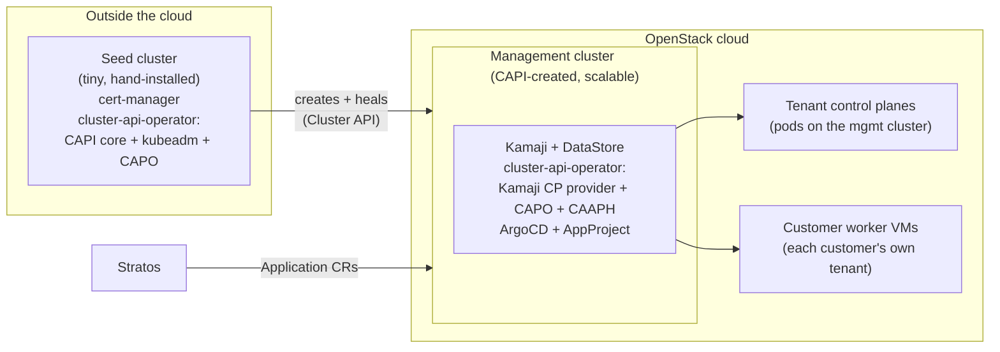
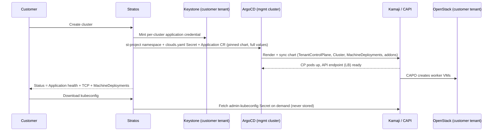

# Managed Kubernetes (kamaji provider) — operator runbook

How to stand up, operate and debug the `kamaji` managed-Kubernetes provider. This is the
operational companion to the internal design plan (kept out of this repo); section
references (§) below point into it. Release posture is **internal-first**
(plan §3.5): we run this ourselves, hardened by these procedures, before customer exposure.

> ## Chart contract: VERIFIED BY RENDER — runtime semantics still need the drill
>
> **The chart lives in this repo** at [`deploy/charts/openstack-kamaji-cluster`](../deploy/charts/)
> and is published to `oci://ghcr.io/menlocloud/stratos-charts`. The values contract in
> `internal/cloud/kamaji/values.go` is verified by rendering that builder's output through
> `helm template` against the chart itself, and `TestBuildValues` pins every key — a chart that
> moves a key breaks a test rather than a customer's cluster create.
>
> (Before vendoring, the contract could only be checked indirectly against the `values.upstream.yaml`
> snapshot the infra-ops wrappers carry, because the chart was OCI-only and auth-gated. That whole
> class of guesswork is gone.)
>
> **Still unverified until the live drill** — these are runtime behaviours no render can prove:
> MachineDeployment naming, autoscale annotation mechanics, upgrade rotation semantics, and the Lua
> health checks against live CRDs. Also unproven: the management-side CCM actually clearing the
> `node.cloudprovider.kubernetes.io/uninitialized` taint from where it runs.

## 0. Bootstrap: from nothing to a management cluster

Everything below assumes a **Kamaji management cluster** already runs inside the OpenStack
cloud. This section is the one-time path that creates it. The shape is a three-stage
bootstrap — each stage manages the next, and the only hand-installed piece is a
deliberately tiny seed cluster:



Why two clusters? The management cluster should live *inside* the cloud (close to the VMs
it manages, scalable through CAPI like everything else) — but a CAPI cluster cannot create
itself. Something outside the cloud has to hold the Cluster API controllers that create it
and, more importantly, heal it when the cloud has a bad day. That something is the seed
cluster: small, boring, and touched only when the management cluster itself needs surgery.

### 0.1 Seed cluster — outside OpenStack, installed by hand

Any conformant distribution works (kubeadm, k3s, RKE2); a single small node is enough,
three if you want the seed itself HA. It runs nothing but the machinery to manage the next
hop. Install, in order:

1. **cert-manager** (webhook certificates for the CAPI providers).
2. **cluster-api-operator**, declaring four providers: CAPI **core**, the **kubeadm**
   bootstrap + control-plane providers, and the **openstack** infrastructure provider
   (CAPO).
3. An OpenStack **application credential** for the target cloud, as a `clouds.yaml`
   Secret — this is what CAPO authenticates with.

### 0.2 Management cluster — inside OpenStack, created by the seed

From the seed, create a **kubeadm-based** CAPI cluster (for example the
`openstack-cluster` chart from capi-helm-charts). Kubeadm-based on purpose: this cluster
will *host* other clusters' control planes, so its own control plane must be
self-sufficient VMs, not a hosted one.

Cloud prerequisites: an Ubuntu **CAPI node image** in Glance (kubelet/kubeadm baked in,
matching the k8s version), flavors for CP + worker nodes, and an external network for the
API-server LoadBalancer. Scaling is a values change (MachineDeployment replicas or the
autoscaler); k8s upgrades are a new node image + rotation — both driven from the seed.

### 0.3 Kamaji stack — on the management cluster

| Component | Why |
|---|---|
| **Kamaji operator** + `kamaji-etcd` DataStore | Hosts tenant control planes as pods; the DataStore (`default`) is where their etcd state lives. |
| **cluster-api-operator** with the **Kamaji control-plane provider**, kubeadm bootstrap provider and **CAPO** | The tenant-cluster machinery: KamajiControlPlane for CPs, CAPO for worker VMs in customer tenants. |
| **CAAPH** (cluster-api-addon-provider-helm) | Delivers the in-cluster addons (CNI, metrics-server, …) the chart declares. |
| **cert-manager** | Webhook certs for all of the above. |
| **ArgoCD** | The delivery plane — stratos only writes `Application` CRs (§3). |
| **external-dns** (optional) | Only if you want the `dnsZone` feature (§2). |
| Registry mirror | The chart's image defaults pull through an internal mirror; make sure it is reachable from the cloud (§2 extras). |

Then apply `deploy/mgmt-cluster/` (stratos RBAC, the `stratos-k8s` AppProject guardrail,
the ArgoCD health checks) — that is §1 below, and the exact apply order lives in
[`deploy/mgmt-cluster/README.md`](../deploy/mgmt-cluster/README.md).

### 0.4 Attach to stratos

Admin portal → *Cloud providers* → *Add provider* → *Kubernetes*, with the stratos SA
kubeconfig from `deploy/mgmt-cluster/rbac.yaml`. Every field is documented in §2. Pair it
with the OpenStack provider of the same region — worker VMs land in the customer's
keystone tenant of that paired service.

## 1. Management-cluster prerequisites

One-time, per management cluster (details + apply order: [`deploy/mgmt-cluster/README.md`](../deploy/mgmt-cluster/README.md); no management cluster at all yet → start at §0):

1. Kamaji stack live (Kamaji operator, cluster-api-operator + KamajiControlPlane provider,
   CAPO, CAAPH).
2. **ArgoCD installed** (plan D3 — ArgoCD is the delivery plane; stratos only writes
   `Application` CRs, never talks to the ArgoCD API).
3. `deploy/mgmt-cluster/` applied: `rbac.yaml` (stratos ServiceAccount, least-privilege
   RBAC, token), `appproject.yaml` (AppProject `stratos-k8s` — source/destination
   guardrail), `argocd-health.yaml` (custom Lua health for TenantControlPlane / Cluster /
   MachineDeployment — **validate the status fields during the live drill**).
4. **Chart CI pinning**: CI publishes `openstack-kamaji-cluster` + mirrored images to the
   OCI registry at pinned versions. Never `latest`, never `0.0.0+latest` (plan §9) — the
   provider config and every existing cluster pin an exact version, and the registry must
   retain every pinned version.

## 2. Provider setup (admin → Cloud providers → Add provider → Kubernetes)

Seed-file twin of the form: `deploy/seed/external-service-dev.json` (`svc-kamaji-dev`).
A kamaji provider is OpenStack-*adjacent*: control planes live on the management cluster,
worker VMs land in the customer's keystone tenant of the project's **openstack** service
(plan D4) — so a project must be attached to both providers.

| Form field | Config key | Notes |
|---|---|---|
| Management kubeconfig | `secret.kubeconfig` | The stratos SA kubeconfig assembled per the recipe in `deploy/mgmt-cluster/rbac.yaml`. Plain token/client-cert only — no exec plugins. Encrypted at rest. |
| Regions | `config.regions` | The stratos region(s) stamped on cached clusters. Use the same region name as the paired openstack service so flavors/images line up. |
| Services | `config.services` | `{"kubernetes": {"<region>": true}}` — drives the client-portal nav gating. |
| ArgoCD namespace / project | `config.argocd.namespace` / `.project` | Must match `deploy/mgmt-cluster` (`argocd` / `stratos-k8s`). |
| Chart repo / name / version | `config.argocd.chartRepo` / `.chartName` / `.chartVersion` | OCI repo **without** `oci://` prefix. Version is the pin for NEW clusters; existing clusters keep their own pin until a fleet wave moves them. |
| DataStore | `config.cluster.dataStoreName` | Kamaji DataStore name (default `default` = kamaji-etcd). |
| Floating network id | `config.cluster.floatingNetworkId` | On the MANAGEMENT cluster's cloud. Floating network the Kamaji API-server LoadBalancer draws its public IP from — the address customers connect to. |
| External network id | `config.cluster.externalNetworkId` | In the CUSTOMER's project. FALLBACK external network: the egress gateway (managed-network mode) and the `[LoadBalancer] floating-network-id` pool the mgmt-side CCM gives tenant LoadBalancer Services. Usually leave blank — a cluster placed on a chosen network derives this from that network's router at create time; this default only applies when nothing can be derived. **Required if the customer cloud has more than one external network** (CAPO's auto-discovery is a hard error otherwise). |
| DNS zone | `config.cluster.dnsZone` | Optional. API FQDN = `<clusterId>.<zone>` (certSAN + external-dns). Stable across display renames — cluster ids (`stc-<8hex>`) never change (plan §9). |
| Version → image matrix | `config.cluster.versions` | Curated map `k8s version → Glance image id` — the ONLY versions offered to customers. Keep tenant versions within Kamaji compat (mgmt ≥1.33 hosts v1.30–v1.35 today). New CVE node image = new Glance id here, then rotate node groups (§4 below). Textarea grammar: `1.35.4=<image-id>` per line. |
| Image variants | `config.cluster.imageVariants` | Alternative node-image builds of the SAME version, keyed by name — e.g. an `nvidia` GPU build. Textarea grammar: `1.35.4@nvidia=<image-id>`. Customers pick a variant per node group ("Node image"); upgrades keep each pool on its variant and refuse a target the variant doesn't cover. A variant line needs its version's default line too. |
| Flavors allowlist | `config.cluster.flavors` | Flavor ids offered in the cluster-create wizard. **Empty array = no restriction** (full region flavor catalog). Use it to keep GPU/baremetal flavors out of node groups. |
| Storage volume type | `config.cluster.storageVolumeType` | The Cinder volume type behind every cluster's default StorageClass. The class is **named after the type** (e.g. `multiattach`); unset = class `csi-cinder` on the cloud's default type. Shown to customers in the create wizard. |
| Registry mirrors | `config.cluster.registryMirrors` | Optional containerd pull-through map, `host → [mirror endpoints]`, rendered by the chart into `/etc/containerd/certs.d/<host>/hosts.toml` on every node. Covers **every** pull the node makes — CNI/CSI/add-ons at bootstrap and the customer's own images — and falls back to the upstream registry on a miss. This is the lever against public-registry rate limits (the difference between a 10-minute create and an hour of `ImagePullBackOff`). Endpoints are registry **API roots**: a Harbor proxy-cache project is `https://<harbor>/v2/<project>`. Textarea grammar: `docker.io=https://harbor.example.com/v2/dockerhub` per line; repeat a host for a fallback endpoint. The chart ships **no** mirrors of its own (0.8.0 dropped the inherited Azimuth default), so a registry you don't list is pulled from directly — list every one you want cached. Include `registry-1.docker.io`: containerd treats it as a namespace of its own and Bitnami-style charts write it literally. Applied at create; existing clusters keep the mirrors on their Application. |
| Pod placement | `config.cluster.scheduling` | Optional `{nodeSelector, tolerations}` for everything a cluster runs **on the management cluster**: the hosted control-plane pods, the per-cluster OpenStack CCM, the Cinder CSI controller and the autoscaler (all four — one left off the pool makes "dedicated" a half-truth). Worker VMs are Nova servers and are unaffected. Use it to give the management cluster a dedicated node pool that scales on tenant-cluster demand alone: label + taint the pool and set BOTH halves — a selector alone still lets other workloads on, a toleration alone does not keep control planes there. Form grammar: `label=value` per line; tolerations as `key=value:Effect` / `key:Effect` / `key`. Applied at create; existing clusters keep the placement on their Application. |
| Browse provider | `config.cluster.openstackServiceId` | Optional QoL: link the paired OpenStack provider and the form's flavor / node-image / volume-type fields become live-catalog pickers instead of hand-pasted UUIDs. |

### Management-cluster extras the features assume

- **external-dns** on the management cluster, watching Services — the DNS zone feature
  publishes `<clusterId>.<zone>` off the API-server LoadBalancer's
  `external-dns.alpha.kubernetes.io/hostname` annotation, and the downloaded kubeconfig is
  rewritten to that name (the apiserver cert carries it as a SAN, stamped at create — set the
  zone BEFORE creating clusters that should have it).
- **Registry mirror / pull-through** for `registry.k8s.io` (sig-storage CSI sidecars,
  autoscaler) and the OCCM/CSI plugin images — the chart's image values default to
  `registry.menlo.ai/...` paths.

### Topology: one cluster = one availability zone

In this platform an "availability zone" is a **separate cloud** (its own network stack and its
own Kamaji management cluster; only Keystone is shared), and CAPI/Kamaji provision a cluster
inside exactly one of them. A cluster therefore NEVER spans zones — the zone choice is the
location choice at create, full stop. The client UI states this explicitly; there is no
per-node-group AZ picker (the `availabilityZone` API field still passes through to the chart's
`failureDomain` for a future genuinely multi-AZ region). Deploy one kamaji provider per zone,
named consistently with its paired openstack service.

## 2b. Storage — the split Cinder CSI (credential isolation)

Every cluster ships a default StorageClass; PVCs work out of the box. The CSI is split so the
cloud credential **never enters the workload cluster**:

- The CSI **controller** (provisioner/attacher/resizer + the cinder plugin's controller
  service — the only half that authenticates to OpenStack) runs on the MANAGEMENT cluster next
  to the CCM, in the cluster's `st-<project>` namespace, driving the tenant api server through
  the mounted Kamaji admin kubeconfig.
- The workload cluster runs only the **node plugin** with a metadata-only `cloud.conf`
  (verified against cloud-provider-openstack: node-only mode never constructs an OpenStack
  client). `addons.openstack` (the credential push) stays hard-off; a client request can't
  reach it.
- The default class is named after `storageVolumeType` when pinned (see the provider table),
  `csi-cinder` otherwise. `WaitForFirstConsumer`, expansion allowed, reclaim `Delete`.

## 2c. Add-ons, platform updates, rollouts

- **Add-ons**: customers toggle a curated menu (Metrics Server and Node Problem Detector on
  by default; cert-manager, NGINX Ingress, Monitoring stack, NVIDIA GPU Operator, Reloader
  opt-in) at create and later via *Manage add-ons*. Unknown names 400 — the operator-only
  levers (CNI, the credential push, the storage-class override) are not client-reachable.
- **CNI observability**: the CNI is Cilium with **Hubble and hubble-relay enabled by
  default** (chart ≥ 0.7.0) — every cluster has flow observability out of the box
  (`cilium hubble port-forward` + the `hubble` CLI against the relay). The Hubble UI stays
  opt-in via the chart values; its images are already mirrored.
- **Platform (chart) updates**: every cluster pins the chart version it was created with; the
  provider's `chartVersion` only affects NEW clusters. Moving an existing cluster is explicit:
  the customer's *Apply platform update* button (offered when behind the provider pin) or the
  admin's per-cluster **Bump** / **Bump all** on the provider page. The update also scrubs any
  legacy `addons.openstack` credential push from the values.
- **Node rollouts** are surge-first (`maxSurge 1 / maxUnavailable 0`, drain bounded by
  `nodeDrainTimeout`): a replacement node comes up and is drained into before the old one is
  removed, one at a time PER GROUP. A cluster-wide upgrade rolls every group concurrently —
  budget one machine of temporary quota headroom per node group; at the quota ceiling the
  rollout waits and resumes by itself.

## 2d. Billing

- `kubernetes_cluster` — the EKS-style flat control-plane fee: price-plan rule on attribute
  `existence` (e.g. `0.10`/hour). Charged only once the API endpoint exists; worker
  VMs/volumes/LBs bill through the ordinary rules (never add k8s rules for them).
- `bucket` — object storage: rule on `size_gb` (per stored GB-hour, ceil'd) or `existence`
  (flat per bucket). Attach the plan to the ceph service.
- Example rules for both live in `deploy/seed/price-plan-seed.json`.

## 3. How provisioning works (what you'll see on the mgmt cluster)



Create path (plan D3/D4/D7):

1. Stratos ensures namespace `st-<projectId>` (labeled `app.kubernetes.io/managed-by: stratos`).
2. Stratos **mints a per-cluster keystone application credential** in the customer's own
   tenant, renders it into a `clouds.yaml` Secret `<clusterId>-cloud-config` in that
   namespace. Mgmt-side only — the customer cluster never carries any OpenStack credential
   (plan D7); blast radius of a leak is that customer's own project.
3. Stratos applies one ArgoCD `Application` named `<clusterId>` (`stc-<8hex>`) in the
   `argocd` namespace: source = pinned chart from our OCI registry, full generated values
   inline, destination = `st-<projectId>`, project = `stratos-k8s`, finalizer
   `resources-finalizer.argocd.argoproj.io`.
4. ArgoCD renders + syncs the chart → TenantControlPlane (CP pods), CAPI Cluster +
   MachineDeployments (worker VMs in the customer tenant), addons. Stratos reads status
   back off the Application health + TCP + MachineDeployments — the custom health checks
   from `argocd-health.yaml` are what make that health signal real.
5. Kubeconfig download is fetch-on-demand from the Kamaji `<tcp>-admin-kubeconfig` secret —
   never stored in stratos (plan D5).

Every change (k8s upgrade, node-group edit, OIDC, chart bump) is the same operation: mutate
the stored desired spec → stratos re-applies the Application (plan §9, one reconcile path).

### Cluster networking (create-time, immutable)

Every cluster is **bring-your-own VPC**: the create wizard requires one of the project's own
networks + subnets (EKS-style "pick your VPC subnet"), and `ClusterSpec.Validate` rejects a spec
without both. The customer never sees an external network id.

A cluster used to be creatable with no pick at all, which meant CAPO built a dedicated network +
subnet + router from `nodeCidr`. That was removed: those nodes sat on a network the customer did
not own, could not route to from the rest of their estate, and could not see in their own network
list — and it was the one create path that skipped the tenant-ownership proof below, since a
platform-created network has nothing to prove.

- **Bring-your-own**: stratos verifies the network + subnet belong to the project's tenant,
  then **derives** the external network from the router that already egresses the chosen
  subnet (falling back to any project router, then the provider default). That derived id
  becomes `spec.externalNetwork` (presence-only for CAPO in BYO mode — verified against a live
  cluster, `status.router` stays empty) **and** the mgmt-side CCM's floating-IP pool, so tenant
  `type: LoadBalancer` Services land on a network routable to their nodes.

All three (`network`, `subnet`, `externalNetwork`) are **immutable after create** in CAPO's
webhook — pinned once into the Application values, never rewritten.

**Ownership marker:** stratos only lists/patches/deletes objects labeled
`app.kubernetes.io/managed-by: stratos`. Pre-existing (infra-ops wrapper) clusters on the
same mgmt cluster are invisible and untouchable until deliberately migrated by stamping
labels.

### Deletion and orphan finalization (sync-driven GC)

Delete path: stratos deletes the Application → the resources-finalizer makes ArgoCD cascade
the delete through everything the chart rendered (TCP, CAPI machines → nova VMs, LB). The
clouds.yaml **secret delete, application-credential revoke, and (when the project's last
cluster is gone) the `st-*` namespace delete are sync-driven finalization** — they happen on
a later sync pass, *after* the ArgoCD cascade completes, not synchronously in the delete
request. Consequences:

- A cluster can show as gone in the UI while its mgmt-cluster leftovers are still being
  finalized. This is normal for minutes, not hours.
- The finalizer is a **service-level sweep** (`syncjob.sweepKamajiOrphans`, once per sync
  cycle): it scans the management cluster itself, so it also reaps leftovers of projects whose
  stratos doc is already gone (scheduled deletion, teardown) — the appcred is revoked against
  the OpenStack service recorded on the secret (`stratos.io/appcred-service` annotation).
  A secret younger than the 30-minute finalize grace window is never touched (create-race
  guard), so freshly-deleted clusters finalize on a later pass.
- **Project teardown defers the keystone tenant delete** while any cluster cascade is still
  running (the cascade deletes worker VMs/LB with tenant-scoped credentials — deleting the
  tenant first would wedge the CAPI finalizers). Teardown then returns an explicit
  "re-run after the sweep finishes" error. Operator flow: wait for the sweep to report clean
  (or check below), then re-run teardown to delete the tenant.

  ```sh
  # namespaces stratos owns, with what's left inside them
  kubectl get ns -l app.kubernetes.io/managed-by=stratos
  kubectl get applications.argoproj.io -n argocd -l app.kubernetes.io/managed-by=stratos
  kubectl get tenantcontrolplanes,machinedeployments -n st-<projectId>
  # manual mop-up is only needed when the sweep reports it CANNOT revoke an appcred
  # (minting service deleted / legacy secret without the service annotation):
  openstack application credential list --user <svc-user>   # revoke strays named stratos-stc-*
  kubectl delete secret -n st-<projectId> <stc-id>-cloud-config
  ```

## 4. Fleet upgrades (plan §9 — read it before running one)

Three separate planes; never conflate them:

| Plane | What changes | How |
|---|---|---|
| Platform (mgmt cluster) | Kamaji operator, cluster-api-operator/CAPO, CAAPH, ArgoCD | infra-ops GitOps + Renovate; staging mgmt cluster first. Operator upgrades do NOT mutate tenant clusters. |
| Per-cluster chart | addon images, CP settings, k8s version | Stratos fleet rollout: bump provider default for NEW clusters immediately; EXISTING clusters move in **waves — canary cluster first, then health-gated batches** (gate = Application Healthy + TCP Ready + MachineDeployments ready). |
| Node images (Glance) | worker OS CVEs, kubelet | New image id in the provider `versions` matrix → node groups rotate via the same MachineDeployment-rotation path as k8s upgrades. |

Ordering guards (enforced by the backend, know them anyway): control plane before nodes;
kubelet never more than 3 minors behind the apiserver; Kamaji CP upgrades roll blue/green;
worker "upgrade" is always a MachineDeployment rotation (Kamaji ships no worker helper).

## 5. Troubleshooting

Start from the ArgoCD Application — it aggregates everything the chart rendered:

```sh
# health + sync state of every stratos cluster
kubectl get applications.argoproj.io -n argocd -l app.kubernetes.io/managed-by=stratos
# one cluster's full resource tree with per-resource health (or use the ArgoCD UI)
argocd app get <stc-id> --show-operation
kubectl get application <stc-id> -n argocd -o jsonpath='{.status.health}{"\n"}{.status.sync}'
```

| Symptom | Look at |
|---|---|
| Application `OutOfSync`/`SyncFailed` | `argocd app get <stc-id>` sync error. "not permitted in project stratos-k8s" → the chart needs a cluster-scoped resource; add exactly that group/kind to `deploy/mgmt-cluster/appproject.yaml` (expected during the unverified-chart phase). Chart pull errors → registry/pin problem (§1.4). |
| Application Healthy but cluster unusable | Health checks not loaded or wrong — verify `argocd-health.yaml` keys exist in argocd-cm and the application controller was restarted; then validate the Lua against the live CRD status (top-blocker caveat). |
| Cluster stuck `PROGRESSING`, no endpoint | `kubectl get tcp -n st-<projectId>` → TCP status. Kamaji CP pods pending → mgmt capacity/datastore; endpoint absent → Octavia LB creation (`kubectl describe svc` in the namespace; floating network id wrong?). |
| Workers not appearing | `kubectl get machinedeployments,machines -n st-<projectId>`; `kubectl describe` a stuck Machine → CAPO events. Usual causes: quota in the customer tenant, wrong Glance image id in the versions matrix, appcred invalid/revoked (check the `<stc-id>-cloud-config` secret exists and the appcred is alive in keystone). |
| MachineDeployment stuck mid-rotation | Old machines not draining / new not joining: `kubectl get machinehealthchecks -n st-<projectId>`; verify the new image id boots (nova console of the new VM in the customer tenant). |
| Delete hangs | Application stays with finalizer while the cascade runs — inspect what's left in the tree (`argocd app get`). Nova VMs refusing to delete block CAPI → fix in the customer tenant. Only remove the finalizer by hand if you accept orphaning the rendered objects, then GC per §3 above. |
| Orphaned namespaces/secrets after teardown | §3 orphan-finalization check. |

## 6. Dev environment (plan §3.0 — decision still open)

Stratos dev points at the kolla test region, which has **no** Kamaji mgmt cluster. Two
options until one is picked and documented:

- **(a) Small k3s/kubeadm mgmt cluster on the kolla VM** with the four mgmt charts
  (kamaji, cluster-api-operator, CAAPH, + ArgoCD), CAPO pointed at kolla. Self-contained;
  matches prod shape end-to-end. Then apply `deploy/mgmt-cluster/` to it and seed
  `svc-kamaji-dev` with its kubeconfig.
- **(b) A dev namespace on the prod `kamaji-cluster-az1`** pointed at kolla. Cheaper, but
  dev traffic shares the prod mgmt cluster and its ArgoCD — acceptable only with the
  AppProject guardrail applied and a separate `stratos-k8s-dev` AppProject.

Either way, the first end-to-end must be the **manual drill** (plan §3.0): one cluster via
hand-written values, then create → ACTIVE → kubeconfig → scale → upgrade one minor → delete
through stratos, plus the accrual drill (CP fee via `kubernetes_cluster`, node VMs via the
existing instance billing — `deploy/seed/price-plan-seed.json`).
